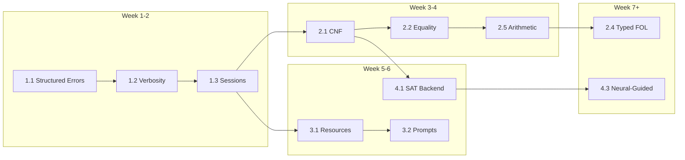

# MCPLogic — Development Roadmap

> **Vision:** Universal "logic nervous system"—a blazing-fast, extensible, protocol-native reasoning hub bridging symbolic precision with neural intuition.

> **Architecture:** Plugin-based engine federation with swappable backends (Prolog → SAT → ASP → neural-guided).

---

## Quick Reference

| Phase | Focus | Key Deliverables | Effort |
|-------|-------|------------------|--------|
| **1** | Core Fortification | Structured errors, verbosity, sessions | 1-2 weeks |
| **2** | Expressiveness | CNF, equality, types, model finder++ | 2-4 weeks |
| **3** | MCP Excellence | Resources, prompts, streaming | 1-2 weeks |
| **4** | Engine Federation | SAT backend, ASP, neural-guided | 3-6 weeks |
| **5** | Advanced Logic | HOL, modal, probabilistic, distributed | Ongoing |

---

## Phase 1: Core Fortification 🔴

*Estimated: 1-2 weeks · Prerequisites: None*

### 1.1 Structured Error Responses

**Goal:** Machine-readable errors with spans, suggestions, and codes.

**Files:** `src/types/errors.ts` (new), `src/logicEngine.ts`, `src/modelFinder.ts`, `src/parser.ts`

**Tasks:**
- [ ] Define `LogicErrorCode` enum and `LogicError` interface
- [ ] Propagate parser position info to error objects
- [ ] Add syntax suggestion engine (common mistakes → fixes)
- [ ] Update all `throw` sites to use structured errors
- [ ] Add error serialization for MCP responses

```typescript
// src/types/errors.ts
export type LogicErrorCode = 
  | 'PARSE_ERROR'           // Syntax errors in formula
  | 'INFERENCE_LIMIT'       // Hit max inference steps
  | 'UNSATISFIABLE'         // Contradiction detected
  | 'TIMEOUT'               // Operation exceeded time limit
  | 'NO_MODEL'              // Model finder exhausted search
  | 'INVALID_DOMAIN'        // Model finder domain constraint
  | 'ENGINE_ERROR';         // Internal Prolog error

export interface LogicError {
  code: LogicErrorCode;
  message: string;
  span?: { start: number; end: number; line?: number; col?: number };
  suggestion?: string;
  context?: string;          // The problematic formula/term
  details?: Record<string, unknown>;
}

export class LogicException extends Error {
  constructor(public readonly error: LogicError) {
    super(error.message);
  }
}
```

**Suggestions Engine (Low-Effort Win):**
| Pattern | Suggestion |
|---------|------------|
| Missing `)` | "Unbalanced parentheses - missing closing ')'" |
| `All` vs `all` | "Use lowercase 'all' for universal quantifier" |
| `P(x) ->` at EOL | "Incomplete implication - missing consequent" |
| `x = Y` mixed case | "Variables should be consistently cased" |

**Concerns:**
- Breaking change → add `format_version: 2` to responses
- Ensure backwards compatibility via `legacy_errors?: boolean` param

---

### 1.2 Verbosity Control

**Goal:** Token-efficient responses for LLM chains; detailed traces for debugging.

**Files:** `src/server.ts`, `src/logicEngine.ts`, `src/types/index.ts`

**Tasks:**
- [ ] Add `verbosity` to all tool input schemas
- [ ] Implement response builder with verbosity filtering
- [ ] Capture inference trace when `detailed` requested
- [ ] Store generated Prolog for debugging

```typescript
type Verbosity = 'minimal' | 'standard' | 'detailed';

// Response shapes per verbosity:
interface MinimalResponse {
  success: boolean;
  result: 'proved' | 'failed' | 'model_found' | 'no_model';
  model?: { predicates: Record<string, string[]> };  // If model_found
}

interface StandardResponse extends MinimalResponse {
  message: string;
  bindings?: Record<string, string>[];
  interpretation?: string;
}

interface DetailedResponse extends StandardResponse {
  prologProgram: string;        // Generated Prolog code
  inferenceSteps: string[];     // Step-by-step trace
  statistics: {
    inferences: number;
    timeMs: number;
    domainSize?: number;
  };
  ast?: ASTNode;                // Parsed AST for debugging
}
```

**Token Savings Estimate:**
| Verbosity | Typical Response Size |
|-----------|----------------------|
| `minimal` | ~50-100 tokens |
| `standard` | ~150-300 tokens |
| `detailed` | ~500-1000+ tokens |

---

### 1.3 Session-Based Reasoning

**Goal:** Incremental KB construction with persistent sessions and TTL.

**Files:** `src/sessionManager.ts` (new), `src/server.ts`

**New MCP Tools:**
| Tool | Description | Complexity |
|------|-------------|------------|
| `create-session` | Create new session, returns ID | Low |
| `assert-premise` | Add formula to session KB | Low |
| `query-session` | Query accumulated KB | Low |
| `retract-premise` | Remove specific premise | Medium |
| `list-premises` | Enumerate current KB | Low |
| `clear-session` | Reset session KB | Low |
| `delete-session` | Destroy session | Low |

```typescript
// src/sessionManager.ts
import { randomUUID } from 'crypto';
import { LogicEngine } from './logicEngine.js';

export interface Session {
  id: string;
  premises: string[];          // Original FOL formulas
  prologProgram: string;       // Compiled Prolog
  createdAt: number;
  lastAccessedAt: number;
  ttlMs: number;               // Default: 30 minutes
}

export class SessionManager {
  private sessions = new Map<string, Session>();
  private gcIntervalMs = 60_000;  // Run GC every minute
  private defaultTtlMs = 30 * 60 * 1000;  // 30 minutes

  constructor() {
    setInterval(() => this.gc(), this.gcIntervalMs);
  }

  create(ttlMs?: number): Session {
    const session: Session = {
      id: randomUUID(),
      premises: [],
      prologProgram: '',
      createdAt: Date.now(),
      lastAccessedAt: Date.now(),
      ttlMs: ttlMs ?? this.defaultTtlMs,
    };
    this.sessions.set(session.id, session);
    return session;
  }

  get(id: string): Session | undefined {
    const session = this.sessions.get(id);
    if (session) session.lastAccessedAt = Date.now();
    return session;
  }

  private gc(): void {
    const now = Date.now();
    for (const [id, session] of this.sessions) {
      if (now - session.lastAccessedAt > session.ttlMs) {
        this.sessions.delete(id);
      }
    }
  }

  // Memory protection
  get count(): number { return this.sessions.size; }
  static readonly MAX_SESSIONS = 1000;
}
```

**Concerns & Mitigations:**
| Concern | Mitigation |
|---------|------------|
| Memory exhaustion | MAX_SESSIONS limit (1000) + aggressive GC |
| Session hijacking | UUIDs are cryptographically random |
| Lost sessions | TTL warning in responses; client should persist IDs |
| MCP has no sessions | Pass `session_id` explicitly in all tools |

### 1.4 Phase 1 Integration & Testing 🧪

**Integration Points:**
- **Server:** Wrap `server.setRequestHandler(CallToolRequestSchema)` in `src/server.ts` with a global error handler that catches `LogicException` and formats it as a structured MCP error.
- **LogicEngine:** Update `prove()` to accept `verbosity` and return `DetailedResponse` when requested.
- **SessionManager:** Instantiate singleton in `createServer()` and inject into new session tools.

**Test Plan:**
- [ ] `tests/errors.test.ts`: Verify all error codes (syntax, timeout, limit) return correct structure.
- [ ] `tests/session.test.ts`: Test create, add, query, retract, expiry flow.
- [ ] `tests/verbosity.test.ts`: Compare `minimal` vs `detailed` output sizes.

**Definition of Done (Phase 1):**
- [ ] All 6 existing tools support `verbosity` parameter
- [ ] New session tools (`create-session`, etc.) are registered in `server.ts`
- [ ] `LogicError` is used consistently across `parser`, `logicEngine`, `modelFinder`
- [ ] `npm test` passes with new test suites
- [ ] `README.md` updated with new tool documentation

---

## Phase 2: Expressiveness Expansion 🟡

*Estimated: 2-4 weeks · Prerequisites: Phase 1 structured errors*

### 2.1 CNF Clausification

**Goal:** Handle arbitrary FOL beyond Horn clauses.

**Files:** `src/clausifier.ts` (new), `src/translator.ts`

**Tasks:**
- [ ] Implement NNF conversion (eliminate →, ↔, push ¬)
- [ ] Implement Skolemization with fresh function symbols
- [ ] Implement CNF distribution (|over &)
- [ ] Add blowup detection with configurable threshold
- [ ] Integrate with `prove` tool via `clausify?: boolean`

**Algorithm (Textbook):**
```
clausify(φ) =
  1. φ₁ = eliminate_biconditional(φ)     // A ↔ B → (A → B) & (B → A)
  2. φ₂ = eliminate_implication(φ₁)      // A → B → ¬A | B  
  3. φ₃ = push_negation_inward(φ₂)       // De Morgan, double negation
  4. φ₄ = standardize_variables(φ₃)      // Unique var names per quantifier
  5. φ₅ = skolemize(φ₄)                  // ∃x → f_sk(free_vars)
  6. φ₆ = drop_universals(φ₅)            // All remaining vars implicitly ∀
  7. φ₇ = distribute_or_over_and(φ₆)     // CNF form
  8. return extract_clauses(φ₇)          // List of disjunctive clauses
```

**Blowup Protection:**
```typescript
interface ClausifyOptions {
  maxClauses?: number;       // Default: 10000
  maxClauseSize?: number;    // Default: 50 literals
  timeout?: number;          // Default: 5000ms
}
```

**References:**
- [Clausification Algorithm](https://en.wikipedia.org/wiki/Conjunctive_normal_form#Conversion_into_CNF)
- [Handbook of Automated Reasoning, Ch 2](https://www.sciencedirect.com/science/article/pii/B9780444508133500042)

---

### 2.2 Equality Reasoning

**Goal:** First-class equality with auto-generated axioms.

**Files:** `src/equalityAxioms.ts` (new), `src/logicEngine.ts`, `src/translator.ts`

**Tasks:**
- [ ] Detect equality predicates (`=`, `eq`, `equals`) in formulas
- [ ] Auto-inject equality axiom schema
- [ ] Generate congruence axioms for detected function symbols
- [ ] Add `equality_axioms?: boolean` parameter (default: true)
- [ ] Optimization: only inject used axioms

```typescript
// src/equalityAxioms.ts
export function generateEqualityAxioms(
  functions: Map<string, number>  // name → arity
): string[] {
  const axioms = [
    'eq(X, X).',                           // Reflexivity
    'eq(X, Y) :- eq(Y, X).',               // Symmetry
    'eq(X, Z) :- eq(X, Y), eq(Y, Z).',     // Transitivity
  ];
  
  // Congruence axioms for each function
  for (const [fn, arity] of functions) {
    if (arity === 1) {
      axioms.push(`eq(${fn}(X), ${fn}(Y)) :- eq(X, Y).`);
    } else if (arity === 2) {
      axioms.push(`eq(${fn}(X1,X2), ${fn}(Y1,Y2)) :- eq(X1,Y1), eq(X2,Y2).`);
    }
    // ... extend for higher arities
  }
  
  return axioms;
}
```

**Performance Concern:** Symmetry/transitivity can cause infinite loops.
**Mitigation:** Use tabling (memoization) in Tau-Prolog or iteration-limit.

---

### 2.3 Model Finder Enhancements

**Goal:** Faster, smarter model finding.

**Files:** `src/modelFinder.ts`

**Tasks:**
- [ ] **Symmetry breaking**: Canonical ordering for isomorphic models
- [ ] **Early termination**: Fail fast on unsatisfiable subformulas
- [ ] **Partial models**: Return best-effort on timeout
- [ ] **Function symbols**: Interpret functions as total mappings
- [ ] **Incremental search**: Resume from checkpoint on retry

**Symmetry Breaking (Lex-Leader):**
```typescript
// For domain {0, 1, 2} with constants a, b:
// Force a ≤ b to avoid symmetric models {a=0,b=1} ≈ {a=1,b=0}
function* enumerateWithSymmetryBreaking(
  constants: string[],
  domainSize: number
): Generator<Map<string, number>> {
  // Only yield assignments where c_i ≤ c_{i+1}
  // Reduces search space by up to n! for n constants
}
```

**Performance Targets:**
| Domain Size | Current | Target |
|-------------|---------|--------|
| ≤5 | <100ms | <50ms |
| 6-8 | <1s | <500ms |
| 9-10 | <10s | <5s |
| >10 | N/A | Via SAT (Phase 4) |

---

### 2.4 Typed/Sorted FOL

**Goal:** Domain-constraining type annotations.

**Files:** `src/parser.ts`, `src/types/ast.ts`, `src/modelFinder.ts`, `src/syntaxValidator.ts`

**Syntax:**
```
all x:Person (mortal(x))
exists y:Nat (successor(y) = z)
type Color = {red, green, blue}
```

**Tasks:**
- [ ] Extend tokenizer to recognize `:Type`
- [ ] Add `typeAnnotation?: string` to variable AST nodes
- [ ] Type inference for untyped variables (from predicate signatures)
- [ ] Built-in types: `Nat`, `Int`, `Bool`
- [ ] User-defined finite types via `type Name = {v1, v2, ...}`
- [ ] Model finder: restrict search to typed domains

**Implementation Strategy (Low Effort):**
```typescript
// Don't modify parser heavily - use post-processing
function inferTypes(ast: ASTNode, typeHints: Map<string, string>): TypedAST {
  // Walk AST, annotate variables with inferred types
  // Type hints come from: explicit annotations, predicate signatures, context
}
```

---

### 2.5 Arithmetic Support 🆕

**Goal:** Basic arithmetic via Tau-Prolog's built-in module.

**Files:** `src/logicEngine.ts`

**Tasks:**
- [ ] Load Tau-Prolog arithmetic module at session creation
- [ ] Map FOL arithmetic syntax to Prolog `is/2` evaluator
- [ ] Support: `+`, `-`, `*`, `/`, `mod`, `<`, `>`, `=<`, `>=`

```typescript
// Enable arithmetic in session creation
const session = pl.create(inferenceLimit);
session.consult(':- use_module(library(lists)).');
// Arithmetic works via: X is 2 + 2, X > 0, etc.
```

**Concern:** Tau-Prolog arithmetic is limited (no bigints, no CLP(FD)).
**Long-term:** Phase 4 SAT/SMT for full arithmetic constraint solving.

**References:**
- [Tau-Prolog Modules](https://tau-prolog.org/documentation#modules)
- Tau-Prolog has `lists`, `random`, `statistics`, `format`, `dom`, `js` modules

---

## Phase 3: MCP Protocol Excellence 🟢

*Estimated: 1-2 weeks · Prerequisites: None (parallel with Phase 1-2)*

### 3.1 MCP Resources

**Goal:** Browsable axiom libraries and formula templates.

**Files:** `src/resources/` (new), `src/server.ts`

**Tasks:**
- [ ] Implement `resources/list` handler (MCP SDK)
- [ ] Implement `resources/read` handler (MCP SDK)
- [ ] Create axiom files in `src/resources/axioms/`

**Resource URIs:**
| URI | Description | Source |
|-----|-------------|--------|
| `logic://axioms/category` | Category theory axioms | Existing `categoricalHelpers.ts` |
| `logic://axioms/group` | Group theory (identity, inverse, assoc) | Existing `groupAxioms()` |
| `logic://axioms/monoid` | Monoid axioms | Existing `monoidAxioms()` |
| `logic://axioms/peano` | Peano arithmetic | New |
| `logic://axioms/set-zfc` | ZFC set theory basics | New |
| `logic://axioms/propositional` | Tautologies & inference rules | New |
| `logic://templates/syllogism` | Classic syllogism patterns | New |

```typescript
// MCP resource handler
server.setRequestHandler(ListResourcesRequestSchema, async () => ({
  resources: [
    { uri: 'logic://axioms/category', name: 'Category Theory', mimeType: 'text/plain' },
    // ...
  ]
}));

server.setRequestHandler(ReadResourceRequestSchema, async (request) => {
  const content = await loadResource(request.params.uri);
  return { contents: [{ uri: request.params.uri, text: content }] };
});
```

---

### 3.2 MCP Prompts

**Goal:** Pre-built reasoning patterns as prompt templates.

**Files:** `src/prompts/` (new), `src/server.ts`

**Prompts:**
| Name | Purpose | Arguments |
|------|---------|-----------|
| `prove-by-contradiction` | Setup for indirect proof | `statement` |
| `verify-equivalence` | Prove A↔B via A→B ∧ B→A | `formula_a`, `formula_b` |
| `formalize` | Guide NL→FOL translation | `natural_language`, `domain_hint?` |
| `diagnose-unsat` | Find minimal unsat subset | `premises[]` |
| `explain-proof` | Human-readable proof explanation | `premises[]`, `conclusion` |

```typescript
// Example prompt template
const proveByContradiction = {
  name: 'prove-by-contradiction',
  description: 'Set up an indirect proof by assuming the negation',
  arguments: [
    { name: 'statement', description: 'The statement to prove', required: true }
  ],
  template: `To prove "{statement}" by contradiction:
1. Assume the negation: -({statement})
2. Add this to your premises
3. Derive a contradiction (prove "false" or "P & -P")
4. Conclude the original statement holds

Suggested tool call:
{
  "name": "prove",
  "arguments": {
    "premises": ["your_axioms...", "-({statement})"],
    "conclusion": "false"
  }
}`
};
```

---

### 3.3 Streaming Progress

**Goal:** Real-time progress for long-running operations.

**Files:** `src/server.ts`, `src/modelFinder.ts`, `src/logicEngine.ts`

**MCP Progress Protocol:**
```typescript
// MCP SDK supports progress notifications via tokens
interface ProgressNotification {
  method: 'notifications/progress';
  params: {
    progressToken: string | number;
    progress: number;      // 0.0 - 1.0
    total?: number;
    message?: string;
  };
}
```

**Tasks:**
- [ ] Add progress callback to `ModelFinder.findModel()`
- [ ] Add progress callback to `LogicEngine.prove()` (inference step count)
- [ ] Expose via MCP progress tokens when client supports it
- [ ] Fallback: include `progress` in final response if not streaming

**Implementation (ModelFinder):**
```typescript
async findModel(
  premises: string[],
  options: {
    maxDomainSize?: number;
    onProgress?: (current: number, max: number, message: string) => void;
  }
): Promise<ModelResult> {
  for (let size = 2; size <= maxSize; size++) {
    options.onProgress?.(size, maxSize, `Searching domain size ${size}...`);
    // ... search logic
  }
}
```

**References:**
- [MCP Progress Notifications](https://modelcontextprotocol.io/docs/concepts/utilities#progress)
- MCP supports Streamable HTTP transport for long-lived connections

---

### 3.4 Response Optimization

**Goal:** Minimize payload size for token-constrained LLM callers.

**Tasks:**
- [ ] `omit_echoed_input?: boolean` — Don't echo premises in response
- [ ] `compact_model?: boolean` — Terse model format
- [ ] `proof_summary?: boolean` — One-line summary only

**Compact Model Format:**
```typescript
// Standard format (verbose)
{ predicates: { "man": ["socrates"], "mortal": ["socrates"] } }

// Compact format (terse)
{ "man(socrates)": true, "mortal(socrates)": true }
```

---

## Phase 4: Engine Federation 🔵

*Estimated: 3-6 weeks · Prerequisites: Phase 2 clausification*

### 4.1 SAT/SMT Backend

**Goal:** Scalable model finding and satisfiability via industrial SAT solver.

**Files:** `src/engines/` (new directory), `src/clausifier.ts`

**Package:** [`logic-solver`](https://www.npmjs.com/package/logic-solver) (MiniSat compiled to JS via Emscripten)

**Tasks:**
- [ ] Define `ReasoningEngine` interface for backend abstraction
- [ ] Implement `PrologEngine` adapter wrapping existing `LogicEngine`
- [ ] Implement `SATEngine` adapter using `logic-solver`
- [ ] Build FOL→Prop→CNF→DIMACS pipeline
- [ ] Automatic engine selection based on formula structure
- [ ] Hybrid mode: Prolog for Horn, SAT for general

```typescript
// src/engines/interface.ts
export interface ReasoningEngine {
  readonly name: string;
  readonly capabilities: {
    horn: boolean;           // Handles Horn clauses
    fullFol: boolean;        // Handles arbitrary FOL
    equality: boolean;       // Has equality reasoning
    arithmetic: boolean;     // Has arithmetic
    findModel: boolean;      // Can find models
    streaming: boolean;      // Supports progress
  };
  
  prove(premises: string[], conclusion: string, options?: ProveOptions): Promise<ProveResult>;
  findModel(premises: string[], options?: ModelOptions): Promise<ModelResult>;
  checkSat(clauses: Clause[]): Promise<SatResult>;  // Direct CNF input
}

// src/engines/sat.ts
import Logic from 'logic-solver';

export class SATEngine implements ReasoningEngine {
  readonly name = 'sat/minisat';
  readonly capabilities = { horn: true, fullFol: true, equality: false, arithmetic: false, findModel: true, streaming: false };
  
  async checkSat(clauses: Clause[]): Promise<SatResult> {
    const solver = new Logic.Solver();
    // Convert clauses to logic-solver format
    for (const clause of clauses) {
      solver.require(Logic.or(...clause.literals.map(l => 
        l.negated ? Logic.not(l.atom) : l.atom
      )));
    }
    const solution = solver.solve();
    return solution ? { sat: true, model: solution.getMap() } : { sat: false };
  }
}
```

**Performance Comparison:**
| Engine | Domain 5 | Domain 10 | Domain 20 | Domain 100 |
|--------|----------|-----------|-----------|------------|
| Brute-force | 50ms | 5s | N/A | N/A |
| SAT (logic-solver) | 10ms | 100ms | 1s | 10s |

**References:**
- [logic-solver npm](https://www.npmjs.com/package/logic-solver) — MiniSat in JS
- [MiniSat](http://minisat.se/) — Industrial SAT solver
- DIMACS CNF format for SAT solver interchange

---

### 4.2 Answer Set Programming (ASP)

**Goal:** Non-monotonic reasoning, defaults, preferences.

**Files:** `src/engines/asp.ts` (new)

**Status:** 🔬 *Research — No mature JS ASP solver exists*

**Options:**
1. **clingo-wasm**: Compile Clingo to WebAssembly (complex, large binary)
2. **Remote API**: Call hosted ASP solver via HTTP
3. **Simplified ASP**: Implement subset in JS (choice rules only)

**ASP Syntax Extensions:**
```
{ bird(X) } :- animal(X).          % Choice rule
:- flies(X), penguin(X).           % Constraint
flies(X) :- bird(X), not penguin(X). % Default
#minimize { cost(X) : assign(X) }. % Optimization
```

**Recommendation:** Defer to Phase 5 unless high demand; focus on SAT first.

---

### 4.3 Neural-Guided Search

**Goal:** LLM-suggested proof paths validated symbolically.

**Files:** `src/engines/neural.ts` (new)

**Architecture:**
```
Query → LLM proposes lemmas/steps → Symbolic validation → Accept/Reject
                ↑                                              ↓
                └──────────── Refinement on rejection ─────────┘
```

**Tasks:**
- [ ] Define prompt templates for proof step suggestion
- [ ] Implement beam search with symbolic scoring
- [ ] Refinement loop: feed back errors to LLM
- [ ] Hybrid confidence: `P(correct) = P(symbolic) * P(neural)`
- [ ] Integration with MCP client for LLM access

```typescript
// src/engines/neural.ts
export interface NeuralGuide {
  suggestNextStep(state: ProofState): Promise<ProofStep[]>;
  refineOnFailure(step: ProofStep, error: string): Promise<ProofStep>;
}

export class NeuralGuidedEngine implements ReasoningEngine {
  constructor(
    private symbolic: ReasoningEngine,  // Prolog or SAT
    private guide: NeuralGuide
  ) {}
  
  async prove(premises: string[], conclusion: string): Promise<ProveResult> {
    // 1. Try pure symbolic first
    const direct = await this.symbolic.prove(premises, conclusion);
    if (direct.success) return direct;
    
    // 2. If failed, use neural guidance
    let state = { premises, goal: conclusion, steps: [] };
    for (let i = 0; i < MAX_STEPS; i++) {
      const suggestions = await this.guide.suggestNextStep(state);
      for (const step of suggestions) {
        const valid = await this.symbolic.prove([...premises, ...state.steps], step.formula);
        if (valid.success) {
          state.steps.push(step.formula);
          if (step.formula === conclusion) return { success: true, proof: state.steps };
        }
      }
    }
    return { success: false, result: 'failed' };
  }
}
```

**Concerns:**
- LLM latency adds to proof time
- Hallucination risk → always validate symbolically
- Token costs for complex proofs

---

## Phase 5: Advanced Extensions 🟣

*Long-term · Prerequisites: Stable Phase 1-4*

### 5.1 Higher-Order Logic (HOL)

**Goal:** Quantify over predicates and functions.

**Syntax:**
```
all P (P(a) -> P(b))              # ∀ over predicates
lambda x. f(x, x)                  # λ-abstraction  
apply(F, X)                        # Function application
```

**Engine Options:**
- **λProlog (ELPI)**: Compile to WASM, high effort
- **HOL Light port**: Very high effort, academic project
- **Shallow embedding**: Encode HOL in FOL (feasible)

**Recommendation:** Start with shallow embedding in FOL.

---

### 5.2 Modal & Temporal Logic

**Goal:** Necessity (□), possibility (◊), temporal operators.

**Syntax:**
```
box(P)                    # □P necessarily P
diamond(P)                # ◊P possibly P
always(P)                 # □P (temporal)
eventually(P)             # ◊P (temporal)
until(P, Q)               # P U Q
next(P)                   # ○P
```

**Engine:** Kripke model construction + standard FOL reasoning.

**Implementation Sketch:**
```prolog
% Encode Kripke accessibility as a relation
accessible(World1, World2).

% Box: true in all accessible worlds
holds(box(P), W) :- forall(accessible(W, W2), holds(P, W2)).

% Diamond: true in some accessible world  
holds(diamond(P), W) :- accessible(W, W2), holds(P, W2).
```

---

### 5.3 Probabilistic Reasoning

**Goal:** Weighted facts, Bayesian inference.

**Syntax:**
```
0.7 :: rain.                      # P(rain) = 0.7
0.9 :: wet_ground :- rain.        # P(wet|rain) = 0.9
query(wet_ground).                # Compute P(wet_ground)
```

**Engine Options:**
- **ProbLog**: Compile to WASM (exists as Python, not JS)
- **Custom**: Implement sampling/enumeration in TS

**References:**
- [ProbLog](https://dtai.cs.kuleuven.be/problog/)
- Probabilistic logic programming fundamentals

---

### 5.4 Distributed Proof Networks (Vision)

**Goal:** P2P theorem proving swarms, on-chain verification.

**Concepts:**
- **Proof obligation distribution**: Shard large proofs across nodes
- **Proof-of-proof**: Alternative to proof-of-work
- **On-chain anchoring**: Hash proofs to blockchain for verifiability
- **Gossip protocol**: Efficient proof fragment dissemination

**Status:** 🔮 *Visionary — significant research required*

---

## Technical Debt 📚

### Test Coverage

**Current:** `tests/basic.test.ts`, `tests/parser.test.ts`, `tests/prover.test.ts`

**Tasks:**
- [ ] Edge cases: Empty premises, recursive formulas, deep nesting (>10 levels)
- [ ] Error paths: All `LogicErrorCode` variants
- [ ] Integration: Full MCP round-trip with mock client
- [ ] Performance: Benchmarks for large formulas (>100 clauses)
- [ ] Property-based: Roundtrip parsing with fast-check
- [ ] Regression: Capture failing cases as golden tests

**Testing Tools:**
```bash
npm test                          # All tests
npm test -- --coverage            # With coverage report
npm test -- --testPathPattern=parser  # Parser tests only
```

---

### Type Safety

- [x] Created `src/types/tau-prolog.d.ts`
- [x] Removed `@ts-ignore` comments
- [ ] Enable `strict: true` in tsconfig
- [ ] Expand Tau-Prolog type coverage
- [ ] Add branded types for SessionId, Formula, etc.

---

### Documentation

- [ ] JSDoc on all public exports
- [ ] Architecture diagram (Mermaid) in README
- [ ] Formula syntax reference card (markdown)
- [ ] Example gallery with 10+ patterns
- [ ] API changelog for breaking changes

---

## Known Limitations

| Limitation | Impact | Mitigation |
|------------|--------|------------|
| Inference depth (Tau-Prolog default) | Truncates valid proofs | Increase via `inferenceLimit` param |
| Non-termination | Infinite loops possible | Timeout protection |
| Negation as failure | `¬P` = "cannot prove P" | Document clearly; use NAF syntax |
| Closed-world assumption | Missing facts = false | Document; consider open-world mode |
| No native arithmetic | `2+2=4` fails | Enable Tau-Prolog arithmetic module |
| Model finder ≤10 | Large domains impossible | SAT backend (Phase 4) |

---

## External References

| Topic | Resource |
|-------|----------|
| **Tau-Prolog** | [Documentation](https://tau-prolog.org/documentation) · [Modules](https://tau-prolog.org/documentation#modules) · [npm](https://www.npmjs.com/package/tau-prolog) |
| **MCP** | [Specification](https://modelcontextprotocol.io/docs) · [SDK](https://github.com/modelcontextprotocol/typescript-sdk) · [Progress](https://modelcontextprotocol.io/docs/concepts/utilities#progress) |
| **SAT** | [logic-solver npm](https://www.npmjs.com/package/logic-solver) · [MiniSat](http://minisat.se/) · [DIMACS](https://www.cs.ubc.ca/~hoos/SATLIB/Benchmarks/SAT/satformat.ps) |
| **Logic** | [Prover9 Manual](https://www.cs.unm.edu/~mccune/prover9/manual/) · [Clausification](https://en.wikipedia.org/wiki/Conjunctive_normal_form) · [Model Theory](https://plato.stanford.edu/entries/model-theory/) |
| **Modal** | [Kripke Semantics](https://plato.stanford.edu/entries/logic-modal/) · [Temporal Logic](https://plato.stanford.edu/entries/logic-temporal/) |
| **Probabilistic** | [ProbLog](https://dtai.cs.kuleuven.be/problog/) · [Probabilistic Logic](https://plato.stanford.edu/entries/logic-probability/) |

---

## File Structure (Target)

```
src/
├── index.ts                    # Entry point
├── server.ts                   # MCP server (tools, resources, prompts)
├── parser.ts                   # FOL tokenizer & parser
├── translator.ts               # FOL ↔ Prolog conversion
├── clausifier.ts               # [Phase 2] CNF conversion, Skolemization
├── logicEngine.ts              # Tau-Prolog wrapper
├── modelFinder.ts              # Finite model enumeration  
├── syntaxValidator.ts          # Formula validation
├── categoricalHelpers.ts       # Category theory axioms
├── sessionManager.ts           # [Phase 1] Session lifecycle
├── equalityAxioms.ts           # [Phase 2] Auto-generated equality
├── types/
│   ├── index.ts
│   ├── errors.ts               # [Phase 1] Structured errors
│   ├── ast.ts                  # [Phase 2] Typed AST
│   └── tau-prolog.d.ts
├── engines/                    # [Phase 4] Backend federation
│   ├── interface.ts            # ReasoningEngine interface
│   ├── prolog.ts               # Tau-Prolog adapter
│   ├── sat.ts                  # SAT solver adapter (logic-solver)
│   └── neural.ts               # Neural-guided search
├── resources/                  # [Phase 3] MCP resources
│   └── axioms/
│       ├── category.fol
│       ├── group.fol
│       ├── peano.fol
│       └── propositional.fol
└── prompts/                    # [Phase 3] MCP prompts
    ├── prove-by-contradiction.ts
    ├── verify-equivalence.ts
    └── formalize.ts
tests/
├── basic.test.ts
├── parser.test.ts
├── prover.test.ts
├── clausifier.test.ts          # [Phase 2]
├── session.test.ts             # [Phase 1]
├── sat.test.ts                 # [Phase 4]
└── integration.test.ts         # [Phase 3]
```

---

## Implementation Order (Recommended)



**Parallel Tracks:**
- **Track A (Core):** 1.1 → 1.2 → 1.3 → 2.1 → 4.1
- **Track B (MCP):** 3.1 → 3.2 → 3.3 (can run in parallel)
- **Track C (Expressiveness):** 2.2 → 2.5 → 2.4 (after 1.1)
