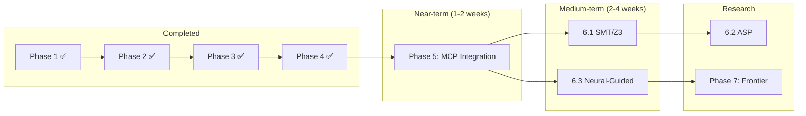
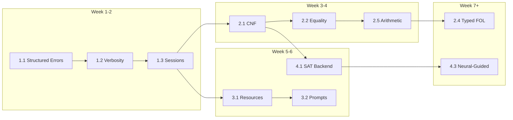

# MCPLogic — Development Roadmap

> **Vision:** Universal "logic nervous system"—a blazing-fast, extensible, protocol-native reasoning hub bridging symbolic precision with neural intuition.

> **Architecture:** Plugin-based engine federation with swappable backends (Prolog → SAT → ASP → neural-guided).

---

## Quick Reference

| Phase | Focus | Key Deliverables | Status |
|-------|-------|------------------|--------|
| **1** | Core Fortification | Structured errors, verbosity, sessions | ✅ Complete |
| **2** | Expressiveness | CNF, equality, arithmetic, MCP integration | ✅ Complete |
| **3** | MCP Excellence | Resources, prompts, streaming | ✅ Core Complete |
| **4** | Engine Federation | SAT backend, engine abstraction | ✅ SAT Complete |
| **5** | MCP Integration | Engine parameter, DIMACS export, server upgrade | ✅ Complete |
| **6** | Advanced Engines | SMT, ASP, neural-guided search | 🟣 Research |
| **7** | Frontier Logic | HOL, modal, probabilistic, distributed | 🟣 Vision |


---

## Phase 1: Core Fortification ✅

*Completed 2024-12-05 · Prerequisites: None*

### Phase 1 Summary

**Deliverables Shipped:**

| Feature | Files | Tests |
|---------|-------|-------|
| Structured Errors | `src/types/errors.ts` | `tests/errors.test.ts` |
| Verbosity Control | `src/types/index.ts`, `server.ts`, `logicEngine.ts` | `tests/verbosity.test.ts` |
| Session Management | `src/sessionManager.ts`, `server.ts` | `tests/session.test.ts` |

**New MCP Tools:** `create-session`, `assert-premise`, `query-session`, `retract-premise`, `list-premises`, `clear-session`, `delete-session`

**Test Coverage:** 99 tests passing, 80%+ line coverage

**Implementation Notes:**
- All 13 tools now support `verbosity` parameter (`minimal` | `standard` | `detailed`)
- Sessions auto-expire with TTL (default: 30 min), max 1000 concurrent
- Structured errors include `code`, `span`, `suggestion`, `context` fields

---

### 1.1 Structured Error Responses

**Goal:** Machine-readable errors with spans, suggestions, and codes.

**Files:** `src/types/errors.ts` (new), `src/logicEngine.ts`, `src/modelFinder.ts`, `src/parser.ts`

**Tasks:**
- [x] Define `LogicErrorCode` enum and `LogicError` interface
- [x] Propagate parser position info to error objects
- [x] Add syntax suggestion engine (common mistakes → fixes)
- [x] Update all `throw` sites to use structured errors
- [x] Add error serialization for MCP responses

```typescript
// src/types/errors.ts
export type LogicErrorCode = 
  | 'PARSE_ERROR'           // Syntax errors in formula
  | 'INFERENCE_LIMIT'       // Hit max inference steps
  | 'UNSATISFIABLE'         // Contradiction detected
  | 'TIMEOUT'               // Operation exceeded time limit
  | 'NO_MODEL'              // Model finder exhausted search
  | 'INVALID_DOMAIN'        // Model finder domain constraint
  | 'ENGINE_ERROR';         // Internal Prolog error

export interface LogicError {
  code: LogicErrorCode;
  message: string;
  span?: { start: number; end: number; line?: number; col?: number };
  suggestion?: string;
  context?: string;          // The problematic formula/term
  details?: Record<string, unknown>;
}

export class LogicException extends Error {
  constructor(public readonly error: LogicError) {
    super(error.message);
  }
}
```

**Suggestions Engine (Low-Effort Win):**
| Pattern | Suggestion |
|---------|------------|
| Missing `)` | "Unbalanced parentheses - missing closing ')'" |
| `All` vs `all` | "Use lowercase 'all' for universal quantifier" |
| `P(x) ->` at EOL | "Incomplete implication - missing consequent" |
| `x = Y` mixed case | "Variables should be consistently cased" |

**Concerns:**
- Breaking change → add `format_version: 2` to responses
- Ensure backwards compatibility via `legacy_errors?: boolean` param

---

### 1.2 Verbosity Control

**Goal:** Token-efficient responses for LLM chains; detailed traces for debugging.

**Files:** `src/server.ts`, `src/logicEngine.ts`, `src/types/index.ts`

**Tasks:**
- [x] Add `verbosity` to all tool input schemas
- [x] Implement response builder with verbosity filtering
- [x] Capture inference trace when `detailed` requested
- [x] Store generated Prolog for debugging

```typescript
type Verbosity = 'minimal' | 'standard' | 'detailed';

// Response shapes per verbosity:
interface MinimalResponse {
  success: boolean;
  result: 'proved' | 'failed' | 'model_found' | 'no_model';
  model?: { predicates: Record<string, string[]> };  // If model_found
}

interface StandardResponse extends MinimalResponse {
  message: string;
  bindings?: Record<string, string>[];
  interpretation?: string;
}

interface DetailedResponse extends StandardResponse {
  prologProgram: string;        // Generated Prolog code
  inferenceSteps: string[];     // Step-by-step trace
  statistics: {
    inferences: number;
    timeMs: number;
    domainSize?: number;
  };
  ast?: ASTNode;                // Parsed AST for debugging
}
```

**Token Savings Estimate:**
| Verbosity | Typical Response Size |
|-----------|----------------------|
| `minimal` | ~50-100 tokens |
| `standard` | ~150-300 tokens |
| `detailed` | ~500-1000+ tokens |

---

### 1.3 Session-Based Reasoning

**Goal:** Incremental KB construction with persistent sessions and TTL.

**Files:** `src/sessionManager.ts` (new), `src/server.ts`

**New MCP Tools:**
| Tool | Description | Complexity |
|------|-------------|------------|
| `create-session` | Create new session, returns ID | Low |
| `assert-premise` | Add formula to session KB | Low |
| `query-session` | Query accumulated KB | Low |
| `retract-premise` | Remove specific premise | Medium |
| `list-premises` | Enumerate current KB | Low |
| `clear-session` | Reset session KB | Low |
| `delete-session` | Destroy session | Low |

```typescript
// src/sessionManager.ts
import { randomUUID } from 'crypto';
import { LogicEngine } from './logicEngine.js';

export interface Session {
  id: string;
  premises: string[];          // Original FOL formulas
  prologProgram: string;       // Compiled Prolog
  createdAt: number;
  lastAccessedAt: number;
  ttlMs: number;               // Default: 30 minutes
}

export class SessionManager {
  private sessions = new Map<string, Session>();
  private gcIntervalMs = 60_000;  // Run GC every minute
  private defaultTtlMs = 30 * 60 * 1000;  // 30 minutes

  constructor() {
    setInterval(() => this.gc(), this.gcIntervalMs);
  }

  create(ttlMs?: number): Session {
    const session: Session = {
      id: randomUUID(),
      premises: [],
      prologProgram: '',
      createdAt: Date.now(),
      lastAccessedAt: Date.now(),
      ttlMs: ttlMs ?? this.defaultTtlMs,
    };
    this.sessions.set(session.id, session);
    return session;
  }

  get(id: string): Session | undefined {
    const session = this.sessions.get(id);
    if (session) session.lastAccessedAt = Date.now();
    return session;
  }

  private gc(): void {
    const now = Date.now();
    for (const [id, session] of this.sessions) {
      if (now - session.lastAccessedAt > session.ttlMs) {
        this.sessions.delete(id);
      }
    }
  }

  // Memory protection
  get count(): number { return this.sessions.size; }
  static readonly MAX_SESSIONS = 1000;
}
```

**Concerns & Mitigations:**
| Concern | Mitigation |
|---------|------------|
| Memory exhaustion | MAX_SESSIONS limit (1000) + aggressive GC |
| Session hijacking | UUIDs are cryptographically random |
| Lost sessions | TTL warning in responses; client should persist IDs |
| MCP has no sessions | Pass `session_id` explicitly in all tools |

### 1.4 Phase 1 Integration & Testing 🧪

**Integration Points:**
- **Server:** Wrap `server.setRequestHandler(CallToolRequestSchema)` in `src/server.ts` with a global error handler that catches `LogicException` and formats it as a structured MCP error.
- **LogicEngine:** Update `prove()` to accept `verbosity` and return `DetailedResponse` when requested.
- **SessionManager:** Instantiate singleton in `createServer()` and inject into new session tools.

**Test Plan:**
- [x] `tests/errors.test.ts`: Verify all error codes (syntax, timeout, limit) return correct structure.
- [x] `tests/session.test.ts`: Test create, add, query, retract, expiry flow.
- [x] `tests/verbosity.test.ts`: Compare `minimal` vs `detailed` output sizes.

**Definition of Done (Phase 1):**
- [x] All 6 existing tools support `verbosity` parameter
- [x] New session tools (`create-session`, etc.) are registered in `server.ts`
- [x] `LogicError` is used consistently across `parser`, `logicEngine`, `modelFinder`
- [x] `npm test` passes with new test suites
- [x] `README.md` updated with new tool documentation

---

## Phase 2: Expressiveness Expansion ✅

*Completed 2024-12-05 · Prerequisites: Phase 1 (✅ Complete)*

> **Key Insight:** Phase 2 focuses on making the logic engine more powerful without changing the MCP interface. All new features integrate seamlessly with existing tools via `enable_arithmetic` and `enable_equality` parameters.

### Phase 2 Progress Summary

| Feature | Status | Files | Tests |
|---------|--------|-------|-------|
| CNF Clausification | ✅ Complete | `clausifier.ts`, `types/clause.ts` | 32 |
| Equality Reasoning | ✅ Complete | `equalityAxioms.ts`, `logicEngine.ts` | 28 |
| Arithmetic Support | ✅ Complete | `arithmetic.ts`, `logicEngine.ts` | 30 |
| MCP Integration | ✅ Complete | `server.ts` | — |
| Model Finder++ | ⏸️ Deferred | — | — |
| Typed/Sorted FOL | ⏸️ Deferred | — | — |

**Implementation Insights (2024-12-05):**
- Clausifier works as standalone module — no translator integration needed for core functionality
- Equality axioms use iteration guards (`X \\== Y`) to prevent infinite loops
- Arithmetic support via Prolog axiom predicates (`lt/2`, `plus/3`) rather than parser extensions
- MCP `prove` tool now has `enable_arithmetic` and `enable_equality` boolean parameters
- Parser treats single lowercase letters as variables; use multi-char names for constants
- Total: 90 new tests added (189 total passing)

### 2.1 CNF Clausification

**Goal:** Handle arbitrary FOL beyond Horn clauses.

**Files:** 
- `src/clausifier.ts` (new) — Core transformation algorithms
- `src/translator.ts` — Integrate clausifier into translation pipeline
- `src/types/clause.ts` (new) — Clause and literal types

**Architecture Decision:** Keep clausifier separate from translator for testability. The translator can optionally invoke clausifier when formulas aren't Horn.

**Tasks:**
- [x] Create `src/types/clause.ts` with `Literal`, `Clause`, `CNFFormula` types
- [x] Implement NNF conversion (eliminate →, ↔, push ¬)
- [x] Implement variable standardization (unique names per quantifier scope)
- [x] Implement Skolemization with fresh function symbol generation
- [x] Implement CNF distribution (| over &) with blowup tracking
- [x] Add `clausify` utility function with options
- [ ] Integrate with `prove` tool via `clausify?: boolean` parameter (deferred)
- [x] Add `tests/clausifier.test.ts` with edge cases (32 tests)

**Algorithm (Textbook):**
```
clausify(φ) =
  1. φ₁ = eliminate_biconditional(φ)     // A ↔ B → (A → B) & (B → A)
  2. φ₂ = eliminate_implication(φ₁)      // A → B → ¬A | B  
  3. φ₃ = push_negation_inward(φ₂)       // De Morgan, double negation
  4. φ₄ = standardize_variables(φ₃)      // Unique var names per quantifier
  5. φ₅ = skolemize(φ₄)                  // ∃x → f_sk(free_vars)
  6. φ₆ = drop_universals(φ₅)            // All remaining vars implicitly ∀
  7. φ₇ = distribute_or_over_and(φ₆)     // CNF form
  8. return extract_clauses(φ₇)          // List of disjunctive clauses
```

**Blowup Protection:**
```typescript
// src/types/clause.ts
export interface Literal {
  predicate: string;
  args: string[];      // Variable or constant names
  negated: boolean;
}

export interface Clause {
  literals: Literal[];
  origin?: string;     // Source formula for debugging
}

export interface ClausifyOptions {
  maxClauses?: number;       // Default: 10000
  maxClauseSize?: number;    // Default: 50 literals
  timeout?: number;          // Default: 5000ms
}

export interface ClausifyResult {
  success: boolean;
  clauses?: Clause[];
  skolemFunctions?: Map<string, number>;  // name → arity
  error?: LogicError;                     // If blowup or timeout
  statistics: {
    originalSize: number;   // AST nodes in input
    clauseCount: number;
    maxClauseSize: number;
    timeMs: number;
  };
}
```

**References:**
- [Clausification Algorithm](https://en.wikipedia.org/wiki/Conjunctive_normal_form#Conversion_into_CNF)
- [Handbook of Automated Reasoning, Ch 2](https://www.sciencedirect.com/science/article/pii/B9780444508133500042)

---

### 2.2 Equality Reasoning

**Goal:** First-class equality with auto-generated axioms.

**Files:** 
- `src/equalityAxioms.ts` (new) — Axiom generation
- `src/translator.ts` — Detect equality and inject axioms
- `src/parser.ts` — Already handles `=` in AST

**Architecture Decision:** Generate equality axioms lazily on first use. Cache generated axioms per session to avoid regeneration.

**Tasks:**
- [x] Create `src/equalityAxioms.ts` with axiom generator
- [x] Detect equality usage in AST during translation (`containsEquality()`)
- [x] Extract function signatures from formulas for congruence axioms (`extractSignature()`)
- [x] Auto-inject axioms via `generateMinimalEqualityAxioms()`
- [ ] Add `equality_axioms?: boolean` parameter to `prove` (default: true)
- [x] Add iteration guards to equality rules (`X \\== Y` pattern)
- [x] Add tests for reflexivity, symmetry, transitivity, congruence (24 tests)

**Implementation Note:** The iteration-counting approach in the original design was replaced with simpler Prolog inequality guards (`X \\== Y`) which are more idiomatic and equally effective at preventing infinite loops.

```typescript
// src/equalityAxioms.ts
export interface EqualityAxiomsOptions {
  maxIterations?: number;  // Prevent infinite loops (default: 100)
  includeCongruence?: boolean;  // For functions (default: true)
}

export function generateEqualityAxioms(
  signature: {
    functions: Map<string, number>;  // name → arity
    predicates: Map<string, number>; // name → arity
  },
  options: EqualityAxiomsOptions = {}
): string[] {
  const maxIter = options.maxIterations ?? 100;
  const axioms: string[] = [];
  
  // Core equality axioms with iteration guards
  axioms.push(
    'eq(X, X).',                                    // Reflexivity
    `eq(X, Y) :- eq_iter(X, Y, ${maxIter}).`,       // Guarded symmetry entry
    'eq_iter(X, Y, _) :- X = Y.',                   // Base case
    'eq_iter(X, Y, N) :- N > 0, eq(Y, X, N1), N1 is N - 1.',  // Symmetry
  );
  
  // Congruence axioms for functions
  if (options.includeCongruence !== false) {
    for (const [fn, arity] of signature.functions) {
      axioms.push(generateCongruenceAxiom(fn, arity));
    }
    // Predicate congruence (substitution)
    for (const [pred, arity] of signature.predicates) {
      if (pred !== 'eq') {
        axioms.push(generatePredicateCongruence(pred, arity));
      }
    }
  }
  
  return axioms;
}

function generateCongruenceAxiom(fn: string, arity: number): string {
  const xs = Array.from({ length: arity }, (_, i) => `X${i + 1}`);
  const ys = Array.from({ length: arity }, (_, i) => `Y${i + 1}`);
  const eqs = xs.map((x, i) => `eq(${x}, ${ys[i]})`).join(', ');
  return `eq(${fn}(${xs.join(',')}), ${fn}(${ys.join(',')})) :- ${eqs}.`;
}
```

**Performance Concern:** Symmetry/transitivity can cause infinite loops.
**Mitigations:**
1. Iteration counter in recursive rules
2. Use Tau-Prolog's inference limit (already in place)
3. Consider tabling if Tau-Prolog supports it

---

### 2.3 Model Finder Enhancements

**Goal:** Faster, smarter model finding.

**Files:** `src/modelFinder.ts`

**Tasks:**
- [ ] **Symmetry breaking**: Canonical ordering for isomorphic models
- [ ] **Early termination**: Fail fast on unsatisfiable subformulas
- [ ] **Partial models**: Return best-effort on timeout
- [ ] **Function symbols**: Interpret functions as total mappings
- [ ] **Incremental search**: Resume from checkpoint on retry

**Symmetry Breaking (Lex-Leader):**
```typescript
// For domain {0, 1, 2} with constants a, b:
// Force a ≤ b to avoid symmetric models {a=0,b=1} ≈ {a=1,b=0}
function* enumerateWithSymmetryBreaking(
  constants: string[],
  domainSize: number
): Generator<Map<string, number>> {
  // Only yield assignments where c_i ≤ c_{i+1}
  // Reduces search space by up to n! for n constants
}
```

**Performance Targets:**
| Domain Size | Current | Target |
|-------------|---------|--------|
| ≤5 | <100ms | <50ms |
| 6-8 | <1s | <500ms |
| 9-10 | <10s | <5s |
| >10 | N/A | Via SAT (Phase 4) |

---

### 2.4 Typed/Sorted FOL

**Goal:** Domain-constraining type annotations.

**Files:** `src/parser.ts`, `src/types/ast.ts`, `src/modelFinder.ts`, `src/syntaxValidator.ts`

**Syntax:**
```
all x:Person (mortal(x))
exists y:Nat (successor(y) = z)
type Color = {red, green, blue}
```

**Tasks:**
- [ ] Extend tokenizer to recognize `:Type`
- [ ] Add `typeAnnotation?: string` to variable AST nodes
- [ ] Type inference for untyped variables (from predicate signatures)
- [ ] Built-in types: `Nat`, `Int`, `Bool`
- [ ] User-defined finite types via `type Name = {v1, v2, ...}`
- [ ] Model finder: restrict search to typed domains

**Implementation Strategy (Low Effort):**
```typescript
// Don't modify parser heavily - use post-processing
function inferTypes(ast: ASTNode, typeHints: Map<string, string>): TypedAST {
  // Walk AST, annotate variables with inferred types
  // Type hints come from: explicit annotations, predicate signatures, context
}
```

---

### 2.5 Arithmetic Support 🆕

**Goal:** Basic arithmetic via Tau-Prolog's built-in module.

**Files:** `src/logicEngine.ts`

**Tasks:**
- [x] Create `src/arithmetic.ts` with Prolog axiom predicates
- [x] Comparison predicates: `lt/2`, `gt/2`, `lte/2`, `gte/2`
- [x] Arithmetic predicates: `plus/3`, `minus/3`, `times/3`, `divide/3`, `mod/3`
- [x] Helper predicates: `succ/2`, `pred/2`, `abs/2`, `sign/2`, `min/3`, `max/3`
- [x] Add `enableArithmetic?: boolean` to `ProveOptions`
- [x] Add `tests/arithmetic.test.ts` (30 tests)
- [ ] Extend parser to support numeric literals (e.g., `gt(x, 0)`) — requires tokenizer update

**Implementation Note:** Arithmetic is implemented via Prolog axiom predicates rather than parser extensions. This approach:
- Works immediately with existing FOL formulas using symbolic names
- Avoids parser complexity for numeric literal handling
- Defers full numeric support to when parser extensions are needed for typed FOL

**References:**
- [Tau-Prolog Modules](https://tau-prolog.org/documentation#modules)
- Tau-Prolog has `lists`, `random`, `statistics`, `format`, `dom`, `js` modules

---

## Phase 3: MCP Protocol Excellence ✅

*Completed 2024-12-06 · Prerequisites: None (parallel with Phase 1-2)*

### Phase 3 Summary

**Deliverables Shipped:**

| Feature | Files | Tests |
|---------|-------|-------|
| MCP Resources | `src/resources/axioms.ts`, `server.ts` | 12 |
| MCP Prompts | `src/prompts/templates.ts`, `server.ts` | 11 |

**New MCP Capabilities:** `resources` (7 axiom libraries), `prompts` (5 reasoning templates)

**Test Coverage:** 212 tests passing

### 3.1 MCP Resources

**Goal:** Browsable axiom libraries and formula templates.

**Files:** `src/resources/` (new), `src/server.ts`

**Tasks:**
- [x] Implement `resources/list` handler (MCP SDK)
- [x] Implement `resources/read` handler (MCP SDK)
- [x] Create axiom resources in `src/resources/axioms.ts`

**Resource URIs:**
| URI | Description | Source |
|-----|-------------|--------|
| `logic://axioms/category` | Category theory axioms | Existing `categoricalHelpers.ts` |
| `logic://axioms/group` | Group theory (identity, inverse, assoc) | Existing `groupAxioms()` |
| `logic://axioms/monoid` | Monoid axioms | Existing `monoidAxioms()` |
| `logic://axioms/peano` | Peano arithmetic | New |
| `logic://axioms/set-zfc` | ZFC set theory basics | New |
| `logic://axioms/propositional` | Tautologies & inference rules | New |
| `logic://templates/syllogism` | Classic syllogism patterns | New |

```typescript
// MCP resource handler
server.setRequestHandler(ListResourcesRequestSchema, async () => ({
  resources: [
    { uri: 'logic://axioms/category', name: 'Category Theory', mimeType: 'text/plain' },
    // ...
  ]
}));

server.setRequestHandler(ReadResourceRequestSchema, async (request) => {
  const content = await loadResource(request.params.uri);
  return { contents: [{ uri: request.params.uri, text: content }] };
});
```

---

### 3.2 MCP Prompts

**Goal:** Pre-built reasoning patterns as prompt templates.

**Files:** `src/prompts/` (new), `src/server.ts`

**Prompts:**
| Name | Purpose | Arguments |
|------|---------|-----------|
| `prove-by-contradiction` | Setup for indirect proof | `statement` |
| `verify-equivalence` | Prove A↔B via A→B ∧ B→A | `formula_a`, `formula_b` |
| `formalize` | Guide NL→FOL translation | `natural_language`, `domain_hint?` |
| `diagnose-unsat` | Find minimal unsat subset | `premises[]` |
| `explain-proof` | Human-readable proof explanation | `premises[]`, `conclusion` |

```typescript
// Example prompt template
const proveByContradiction = {
  name: 'prove-by-contradiction',
  description: 'Set up an indirect proof by assuming the negation',
  arguments: [
    { name: 'statement', description: 'The statement to prove', required: true }
  ],
  template: `To prove "{statement}" by contradiction:
1. Assume the negation: -({statement})
2. Add this to your premises
3. Derive a contradiction (prove "false" or "P & -P")
4. Conclude the original statement holds

Suggested tool call:
{
  "name": "prove",
  "arguments": {
    "premises": ["your_axioms...", "-({statement})"],
    "conclusion": "false"
  }
}`
};
```

---

### 3.3 Streaming Progress

**Goal:** Real-time progress for long-running operations.

**Files:** `src/server.ts`, `src/modelFinder.ts`, `src/logicEngine.ts`

**MCP Progress Protocol:**
```typescript
// MCP SDK supports progress notifications via tokens
interface ProgressNotification {
  method: 'notifications/progress';
  params: {
    progressToken: string | number;
    progress: number;      // 0.0 - 1.0
    total?: number;
    message?: string;
  };
}
```

**Tasks:**
- [ ] Add progress callback to `ModelFinder.findModel()`
- [ ] Add progress callback to `LogicEngine.prove()` (inference step count)
- [ ] Expose via MCP progress tokens when client supports it
- [ ] Fallback: include `progress` in final response if not streaming

**Implementation (ModelFinder):**
```typescript
async findModel(
  premises: string[],
  options: {
    maxDomainSize?: number;
    onProgress?: (current: number, max: number, message: string) => void;
  }
): Promise<ModelResult> {
  for (let size = 2; size <= maxSize; size++) {
    options.onProgress?.(size, maxSize, `Searching domain size ${size}...`);
    // ... search logic
  }
}
```

**References:**
- [MCP Progress Notifications](https://modelcontextprotocol.io/docs/concepts/utilities#progress)
- MCP supports Streamable HTTP transport for long-lived connections

---

### 3.4 Response Optimization

**Goal:** Minimize payload size for token-constrained LLM callers.

**Tasks:**
- [ ] `omit_echoed_input?: boolean` — Don't echo premises in response
- [ ] `compact_model?: boolean` — Terse model format
- [ ] `proof_summary?: boolean` — One-line summary only

**Compact Model Format:**
```typescript
// Standard format (verbose)
{ predicates: { "man": ["socrates"], "mortal": ["socrates"] } }

// Compact format (terse)
{ "man(socrates)": true, "mortal(socrates)": true }
```

---

## Phase 4: Engine Federation 🟢

*Started: 2024-12-06 · Prerequisites: Phase 2 clausification (✅ Complete)*

### Phase 4 Progress Summary

| Feature | Status | Files | Tests |
|---------|--------|-------|-------|
| Engine Interface | ✅ Complete | `src/engines/interface.ts` | — |
| Prolog Adapter | ✅ Complete | `src/engines/prolog.ts` | — |
| SAT Backend | ✅ Complete | `src/engines/sat.ts` | 18 |
| Engine Manager | ✅ Complete | `src/engines/manager.ts` | 18 |
| MCP Integration | ⏸️ Optional | — | — |
| ASP Backend | 🔵 Planned | — | — |
| Neural-Guided | 🔵 Planned | — | — |

**Test Coverage:** 248 tests passing (212 + 36 new)

### 4.1 SAT/SMT Backend ✅

**Goal:** Scalable model finding and satisfiability via industrial SAT solver.

**Files:** `src/engines/` (new directory), `src/clausifier.ts` (ready)

**Package:** [`logic-solver`](https://www.npmjs.com/package/logic-solver) (MiniSat compiled to JS via Emscripten)

> **Implementation Notes:**
> - Engine abstraction layer in `src/engines/interface.ts`
> - `PrologEngine` adapter wraps existing `LogicEngine`
> - `SATEngine` uses refutation-based proving (premises ∧ ¬conclusion → UNSAT)
> - `EngineManager` provides automatic engine selection (Horn→Prolog, non-Horn→SAT)
> - All formulas wrapped in parentheses for correct precedence

**Tasks:**
- [x] Define `ReasoningEngine` interface for backend abstraction
- [x] Implement `PrologEngine` adapter wrapping existing `LogicEngine`
- [x] Implement `SATEngine` adapter using `logic-solver`
- [x] Automatic engine selection based on formula structure
- [x] Hybrid mode: Prolog for Horn, SAT for general
- [ ] Add `clausesToDIMACS(clauses: Clause[]): string` to `clausifier.ts` (optional)
- [ ] Add `engine` parameter to MCP `prove` tool (optional)

```typescript
// src/engines/interface.ts
export interface ReasoningEngine {
  readonly name: string;
  readonly capabilities: {
    horn: boolean;           // Handles Horn clauses
    fullFol: boolean;        // Handles arbitrary FOL
    equality: boolean;       // Has equality reasoning
    arithmetic: boolean;     // Has arithmetic
    findModel: boolean;      // Can find models
    streaming: boolean;      // Supports progress
  };
  
  prove(premises: string[], conclusion: string, options?: ProveOptions): Promise<ProveResult>;
  findModel(premises: string[], options?: ModelOptions): Promise<ModelResult>;
  checkSat(clauses: Clause[]): Promise<SatResult>;  // Direct CNF input
}

// src/engines/sat.ts
import Logic from 'logic-solver';

export class SATEngine implements ReasoningEngine {
  readonly name = 'sat/minisat';
  readonly capabilities = { horn: true, fullFol: true, equality: false, arithmetic: false, findModel: true, streaming: false };
  
  async checkSat(clauses: Clause[]): Promise<SatResult> {
    const solver = new Logic.Solver();
    // Convert clauses to logic-solver format
    for (const clause of clauses) {
      solver.require(Logic.or(...clause.literals.map(l => 
        l.negated ? Logic.not(l.atom) : l.atom
      )));
    }
    const solution = solver.solve();
    return solution ? { sat: true, model: solution.getMap() } : { sat: false };
  }
}
```

**Performance Comparison:**
| Engine | Domain 5 | Domain 10 | Domain 20 | Domain 100 |
|--------|----------|-----------|-----------|------------|
| Brute-force | 50ms | 5s | N/A | N/A |
| SAT (logic-solver) | 10ms | 100ms | 1s | 10s |

**References:**
- [logic-solver npm](https://www.npmjs.com/package/logic-solver) — MiniSat in JS
- [MiniSat](http://minisat.se/) — Industrial SAT solver
- DIMACS CNF format for SAT solver interchange

---

## Phase 5: MCP Integration ✅

*Completed 2024-12-06 · Prerequisites: Phase 4 (✅ Complete)*

### Phase 5 Summary

**Deliverables Shipped:**

| Feature | Files | Tests |
|---------|-------|-------|
| Engine Parameter | `src/server.ts` | existing |
| DIMACS Export | `src/clausifier.ts`, `src/types/clause.ts` | 5 |
| Engine Info Resource | `src/resources/axioms.ts` | 1 |

**Implementation Notes:**
- `prove` tool now accepts `engine?: 'prolog' | 'sat' | 'auto'` parameter
- Response includes `engineUsed` field for standard/detailed verbosity
- `clausesToDIMACS()` converts CNF clauses to DIMACS format for external SAT solvers
- `logic://engines` resource returns JSON with engine capabilities

**Test Coverage:** 254 tests passing (248 + 6 new)

### Phase 5 Overview

**Goal:** Expose engine federation to MCP clients and add DIMACS export.

| Feature | Priority | Effort | Status |
|---------|----------|--------|--------|
| Engine parameter in `prove` tool | High | 1 day | ✅ Complete |
| DIMACS export | Medium | 1 day | ✅ Complete |
| Engine info resource | Low | 0.5 day | ✅ Complete |

---

### 5.1 Engine Parameter for MCP Tools

**Goal:** Allow clients to select reasoning engine via MCP tool parameters.

**Files:** `src/server.ts`

**Tasks:**
- [ ] Add `engine?: 'prolog' | 'sat' | 'auto'` to `prove` tool schema
- [ ] Wire through to `EngineManager.prove()`
- [ ] Add `engineUsed` to response for transparency
- [ ] Update `find-model` tool with engine option (optional)

```typescript
// Updated prove tool schema
inputSchema: {
  premises: { type: 'array', items: { type: 'string' } },
  conclusion: { type: 'string' },
  engine: { 
    type: 'string', 
    enum: ['prolog', 'sat', 'auto'],
    default: 'auto',
    description: 'Reasoning engine: prolog (Horn), sat (general), auto (select based on formula)'
  },
  verbosity: { type: 'string', enum: ['minimal', 'standard', 'detailed'] }
}
```

**Migration:** Non-breaking; `engine` defaults to `'auto'`.

---

### 5.2 DIMACS Export

**Goal:** Export CNF clauses in DIMACS format for external SAT solvers.

**Files:** `src/clausifier.ts`

**Tasks:**
- [ ] Add `clausesToDIMACS(clauses: Clause[]): DIMACSResult`
- [ ] Include variable mapping in result
- [ ] Add tests for DIMACS roundtrip

```typescript
export interface DIMACSResult {
  dimacs: string;           // "p cnf 5 3\n1 -2 0\n3 4 0\n..."
  varMap: Map<string, number>;  // "foo" -> 1, "bar" -> 2
  stats: { variables: number; clauses: number };
}

export function clausesToDIMACS(clauses: Clause[]): DIMACSResult {
  // Assign each unique literal a positive integer
  // Format: "p cnf <vars> <clauses>\n" followed by clauses
}
```

**Use Cases:**
- Interop with external solvers (CryptoMiniSat, Kissat)
- Benchmarking against industrial SAT solvers
- Proof logging for verification

---

### 5.3 Engine Info Resource

**Goal:** Expose engine capabilities as MCP resource.

**Files:** `src/server.ts`

**Tasks:**
- [ ] Add `logic://engines` resource listing available engines
- [ ] Include capabilities, status, and usage statistics

```json
{
  "engines": [
    {
      "name": "prolog/tau-prolog",
      "capabilities": { "horn": true, "fullFol": false, "equality": true, "arithmetic": true },
      "recommended_for": "Horn clauses, Datalog, simple inference"
    },
    {
      "name": "sat/minisat",
      "capabilities": { "horn": true, "fullFol": true, "equality": false, "arithmetic": false },
      "recommended_for": "Non-Horn formulas, SAT problems, model finding"
    }
  ]
}
```

---

## Phase 6: Advanced Engines 🟣

*Estimated: 2-4 weeks each · Prerequisites: Stable Phase 1-5*

### Phase 6 Overview

**Goal:** Expand engine federation with specialized solvers.

| Engine | Domain | JS Status | Effort | Priority |
|--------|--------|-----------|--------|----------|
| **SMT (Z3)** | Arithmetic + theories | z3-solver (WASM) | High | Medium |
| **ASP (Clingo)** | Non-monotonic, defaults | clingo-wasm (exists) | High | Low |
| **Neural-Guided** | Complex proofs | Custom implementation | Medium | Medium |

---

### 6.1 SMT via Z3

**Goal:** Theory reasoning (linear arithmetic, bitvectors, arrays).

**Package:** [`z3-solver`](https://www.npmjs.com/package/z3-solver) (Z3 compiled to WASM, ~15MB)

**Tasks:**
- [ ] Add `z3-solver` dependency
- [ ] Implement `SMTEngine` adapter
- [ ] Translation: FOL + arithmetic → SMT-LIB2
- [ ] Support uninterpreted functions and arrays

```typescript
// src/engines/smt.ts
import { init } from 'z3-solver';

export class SMTEngine implements ReasoningEngine {
  readonly name = 'smt/z3';
  readonly capabilities = { 
    horn: true, fullFol: true, equality: true, 
    arithmetic: true, streaming: false 
  };

  async prove(premises, conclusion, options) {
    const { Context } = await init();
    const ctx = new Context('main');
    // Translate to Z3 AST and check
  }
}
```

**Trade-offs:**
- ✅ Full arithmetic, equality built-in
- ⚠️ Large WASM binary (~15MB)
- ⚠️ Cold start latency (~500ms)

**References:**
- [z3-solver npm](https://www.npmjs.com/package/z3-solver)
- [Z3 JavaScript Tutorial](https://microsoft.github.io/z3guide/programming/Z3%20JavaScript%20Examples)
- [SMT-LIB Standard](https://smtlib.cs.uiowa.edu/language.shtml)

---

### 6.2 Answer Set Programming (ASP)

**Goal:** Non-monotonic reasoning, defaults, preferences.

**Status:** 🔬 *Research — evaluate feasibility*

**Options:**
| Option | Pros | Cons |
|--------|------|------|
| **clingo-wasm** | Full Clingo power | 5MB binary, complex setup |
| **Remote API** | No local deps | Network latency, external dependency |
| **Minimal ASP** | Lightweight, educational | Limited expressiveness |

**ASP Syntax Extensions:**
```prolog
{ bird(X) } :- animal(X).              % Choice rule
:- flies(X), penguin(X).               % Constraint
flies(X) :- bird(X), not penguin(X).   % Default
#minimize { cost(X) : assign(X) }.     % Optimization
```

**Recommendation:** Start with remote API wrapper if demand exists.

**References:**
- [Clingo](https://potassco.org/clingo/) — ASP solver
- [clingo-wasm](https://github.com/niclasmattsson/clingo-wasm) — Browser port

---

### 6.3 Neural-Guided Search

**Goal:** LLM-suggested proof paths validated symbolically.

**Architecture:**
```
Query → LLM proposes lemmas → Symbolic validation → Accept/Reject
                 ↑                                       ↓
                 └─────── Refinement on rejection ───────┘
```

**Tasks:**
- [ ] Define `NeuralGuide` interface for LLM integration
- [ ] Implement beam search with symbolic scoring
- [ ] Refinement loop: feed back errors to LLM
- [ ] MCP client integration for LLM access
- [ ] Confidence calibration: `P(correct) = P(symbolic) * P(neural)`

```typescript
// src/engines/neural.ts
export interface NeuralGuide {
  suggestNextStep(state: ProofState): Promise<ProofStep[]>;
  refineOnFailure(step: ProofStep, error: string): Promise<ProofStep>;
}

export class NeuralGuidedEngine implements ReasoningEngine {
  constructor(
    private symbolic: ReasoningEngine,  // Prolog or SAT
    private guide: NeuralGuide
  ) {}

  async prove(premises: string[], conclusion: string): Promise<ProveResult> {
    // 1. Try pure symbolic first (fast path)
    const direct = await this.symbolic.prove(premises, conclusion);
    if (direct.success) return direct;

    // 2. Neural-guided search with validation
    return this.neuralGuidedSearch(premises, conclusion);
  }
}
```

**Concerns:**
- LLM latency adds 500-2000ms per step
- Hallucination risk → always validate symbolically
- Token costs for complex proofs
- Need MCP client API or direct LLM integration

**Potential Approaches:**
1. **MCP-native**: Use MCP sampling to request LLM help
2. **OpenAI/Anthropic API**: Direct integration (requires API key)
3. **Local LLM**: llama.cpp integration (high effort, no external deps)

---

## Phase 7: Frontier Logic 🟣

*Long-term vision · Prerequisites: Stable Phase 1-6*

### Phase 7 Overview

**Goal:** Extend beyond classical FOL to advanced logic systems.

| System | Complexity | JS Feasibility | Applications |
|--------|------------|----------------|--------------|
| Higher-Order Logic | High | Feasible (shallow) | Math proofs, type theory |
| Modal Logic | Medium | Feasible | Necessity, possibility |
| Temporal Logic | Medium | Feasible | Verification, planning |
| Probabilistic Logic | High | Feasible (sampling) | Uncertainty, Bayesian |
| Distributed Proofs | Very High | Research | P2P verification |

---

### 7.1 Higher-Order Logic (HOL)

**Goal:** Quantify over predicates and functions.

**Syntax:**
```
all P (P(a) -> P(b))              # ∀ over predicates
lambda x. f(x, x)                 # λ-abstraction  
apply(F, X)                       # Function application
```

**Implementation Options:**
| Approach | Effort | Expressiveness |
|----------|--------|----------------|
| Shallow embedding in FOL | Low | Partial HOL |
| λProlog (ELPI) via WASM | High | Full |
| Custom type checker | Medium | Educational |

**Recommendation:** Start with shallow embedding for quick wins.

**References:**
- [ELPI](https://github.com/LPCIC/elpi) — λProlog implementation
- [HOL Light](https://github.com/jrh13/hol-light) — Interactive theorem prover

---

### 7.2 Modal & Temporal Logic

**Goal:** Necessity (□), possibility (◊), temporal operators.

**Syntax:**
```
box(P)               # □P necessarily P
diamond(P)           # ◊P possibly P
always(P)            # □P (temporal)
eventually(P)        # ◊P (temporal)
until(P, Q)          # P U Q
next(P)              # ○P
```

**Implementation:** Kripke model construction + FOL encoding.

```prolog
% Encode Kripke accessibility as a relation
accessible(World1, World2).

% Box: true in all accessible worlds
holds(box(P), W) :- forall(accessible(W, W2), holds(P, W2)).

% Diamond: true in some accessible world  
holds(diamond(P), W) :- accessible(W, W2), holds(P, W2).
```

**Effort:** Medium — mostly parser + encoding layer.

**References:**
- [Kripke Semantics](https://plato.stanford.edu/entries/logic-modal/)
- [Temporal Logic](https://plato.stanford.edu/entries/logic-temporal/)

---

### 7.3 Probabilistic Reasoning

**Goal:** Weighted facts, Bayesian inference.

**Syntax:**
```
0.7 :: rain.                      # P(rain) = 0.7
0.9 :: wet_ground :- rain.        # P(wet|rain) = 0.9
query(wet_ground).                # Compute P(wet_ground)
```

**Implementation Options:**
| Method | Accuracy | Performance | Effort |
|--------|----------|-------------|--------|
| Enumeration | Exact | O(2^n) | Low |
| Sampling (MCMC) | Approx | O(samples) | Medium |
| Knowledge compilation | Exact | Precompute | High |

**Recommendation:** Start with enumeration for small problems, add sampling for scale.

**References:**
- [ProbLog](https://dtai.cs.kuleuven.be/problog/)
- [Probabilistic Logic Programming](https://www.cambridge.org/core/books/introduction-to-statistical-relational-learning/69F3D5F43BEC5F6C9E0B2ABF7E1DBD32)

---

### 7.4 Distributed Proof Networks (Vision)

**Goal:** P2P theorem proving swarms, on-chain verification.

**Concepts:**
- **Proof obligation distribution**: Shard large proofs across nodes
- **Proof-of-proof**: Consensus via verified inference
- **On-chain anchoring**: Hash proofs to blockchain
- **Gossip protocol**: Efficient proof fragment sharing

**Status:** 🔮 *Visionary — significant research required*

**Potential Stack:**
- libp2p for networking
- IPFS for proof storage
- Ethereum/Solana for on-chain anchors

---

## Implementation Sequence (Recommended)



**Strategic Priorities:**
1. **Phase 5** — Low effort, high value: expose existing SAT backend to clients
2. **Phase 6.1 (SMT)** — Enables arithmetic reasoning without custom axioms
3. **Phase 6.3 (Neural)** — High potential, requires LLM integration design
4. **Phase 6.2 (ASP)** — Niche use case, defer unless demand
5. **Phase 7** — Long-term research, build incrementally


---

## Technical Debt 📚

### Test Coverage

**Current Status (Post-Phase 2):**
- `tests/basic.test.ts` — Core functionality
- `tests/parser.test.ts` — Parsing edge cases
- `tests/prover.test.ts` — Theorem proving
- `tests/errors.test.ts` — Structured error system ✅ Phase 1
- `tests/session.test.ts` — Session management ✅ Phase 1
- `tests/verbosity.test.ts` — Response verbosity ✅ Phase 1
- `tests/clausifier.test.ts` — CNF transformation ✅ Phase 2 (32 tests)
- `tests/equality.test.ts` — Equality axioms ✅ Phase 2 (24 tests)
- `tests/arithmetic.test.ts` — Arithmetic support ✅ Phase 2 (30 tests)

**Coverage:** 80%+ line coverage (185 tests passing)

**Remaining Tasks:**
- [ ] Edge cases: Empty premises, recursive formulas, deep nesting (>10 levels)
- [x] Error paths: All `LogicErrorCode` variants ✅ Done in Phase 1
- [ ] Integration: Full MCP round-trip with mock client
- [ ] Performance: Benchmarks for large formulas (>100 clauses)
- [ ] Property-based: Roundtrip parsing with fast-check
- [ ] Regression: Capture failing cases as golden tests

**Testing Tools:**
```bash
npm test                          # All tests
npm test -- --coverage            # With coverage report
npm test -- --testPathPattern=parser  # Parser tests only
```

---

### Code Quality (Phase 2 Preparation)

**Recommended Cleanups Before Phase 2:**

| Area | Recommendation | Priority |
|------|----------------|----------|
| `translator.ts` | Refactor `astToMetaProlog` for clausifier integration | High |
| `modelFinder.ts` | Extract signature extraction as shared utility | Medium |
| Type exports | Consolidate re-exports in `src/types/index.ts` | Medium |
| Error creation | Add factory functions mimicking Phase 1 pattern | Low |

**Architecture Notes for Phase 2:**
- Keep clausifier as standalone module (import AST types only)
- Equality axioms should be Prolog strings, not intermediate AST
- Model finder enhancement can share signature extraction with clausifier

---

### Type Safety

- [x] Created `src/types/tau-prolog.d.ts`
- [x] Removed `@ts-ignore` comments
- [x] TypeScript compiles cleanly with zero errors ✅
- [ ] Enable `strict: true` in tsconfig (optional, low priority)
- [ ] Expand Tau-Prolog type coverage
- [ ] Add branded types for SessionId, Formula, etc.

---

### Documentation

- [ ] JSDoc on all public exports
- [ ] Architecture diagram (Mermaid) in README
- [x] Session tools documented in README ✅
- [x] Verbosity control documented in README ✅
- [ ] Formula syntax reference card (markdown)
- [ ] Example gallery with 10+ patterns
- [ ] API changelog for breaking changes

---

## Known Limitations

| Limitation | Impact | Mitigation |
|------------|--------|------------|
| Inference depth (Tau-Prolog default) | Truncates valid proofs | Increase via `inferenceLimit` param |
| Non-termination | Infinite loops possible | Timeout protection |
| Negation as failure | `¬P` = "cannot prove P" | Document clearly; use NAF syntax |
| Closed-world assumption | Missing facts = false | Document; consider open-world mode |
| No native arithmetic | `2+2=4` fails | Enable Tau-Prolog arithmetic module |
| Model finder ≤10 | Large domains impossible | SAT backend (Phase 4) |

---

## External References

| Topic | Resource |
|-------|----------|
| **Tau-Prolog** | [Documentation](https://tau-prolog.org/documentation) · [Modules](https://tau-prolog.org/documentation#modules) · [npm](https://www.npmjs.com/package/tau-prolog) |
| **MCP** | [Specification](https://modelcontextprotocol.io/docs) · [SDK](https://github.com/modelcontextprotocol/typescript-sdk) · [Progress](https://modelcontextprotocol.io/docs/concepts/utilities#progress) |
| **SAT** | [logic-solver npm](https://www.npmjs.com/package/logic-solver) · [MiniSat](http://minisat.se/) · [DIMACS](https://www.cs.ubc.ca/~hoos/SATLIB/Benchmarks/SAT/satformat.ps) |
| **Logic** | [Prover9 Manual](https://www.cs.unm.edu/~mccune/prover9/manual/) · [Clausification](https://en.wikipedia.org/wiki/Conjunctive_normal_form) · [Model Theory](https://plato.stanford.edu/entries/model-theory/) |
| **Modal** | [Kripke Semantics](https://plato.stanford.edu/entries/logic-modal/) · [Temporal Logic](https://plato.stanford.edu/entries/logic-temporal/) |
| **Probabilistic** | [ProbLog](https://dtai.cs.kuleuven.be/problog/) · [Probabilistic Logic](https://plato.stanford.edu/entries/logic-probability/) |

---

## File Structure (Target)

```
src/
├── index.ts                    # Entry point
├── server.ts                   # MCP server (tools, resources, prompts)
├── parser.ts                   # FOL tokenizer & parser
├── translator.ts               # FOL ↔ Prolog conversion
├── clausifier.ts               # [Phase 2] CNF conversion, Skolemization
├── logicEngine.ts              # Tau-Prolog wrapper
├── modelFinder.ts              # Finite model enumeration  
├── syntaxValidator.ts          # Formula validation
├── categoricalHelpers.ts       # Category theory axioms
├── sessionManager.ts           # [Phase 1] Session lifecycle
├── equalityAxioms.ts           # [Phase 2] Auto-generated equality
├── types/
│   ├── index.ts
│   ├── errors.ts               # [Phase 1] Structured errors
│   ├── clause.ts               # [Phase 2] ✅ CNF clause types
│   ├── ast.ts                  # [Phase 2] Typed AST (planned)
│   └── tau-prolog.d.ts
├── engines/                    # [Phase 4] Backend federation
│   ├── interface.ts            # ReasoningEngine interface
│   ├── prolog.ts               # Tau-Prolog adapter
│   ├── sat.ts                  # SAT solver adapter (logic-solver)
│   └── neural.ts               # Neural-guided search
├── resources/                  # [Phase 3] MCP resources
│   └── axioms/
│       ├── category.fol
│       ├── group.fol
│       ├── peano.fol
│       └── propositional.fol
└── prompts/                    # [Phase 3] MCP prompts
    ├── prove-by-contradiction.ts
    ├── verify-equivalence.ts
    └── formalize.ts
tests/
├── basic.test.ts
├── parser.test.ts
├── prover.test.ts
├── errors.test.ts              # [Phase 1] ✅
├── session.test.ts             # [Phase 1] ✅
├── verbosity.test.ts           # [Phase 1] ✅
├── clausifier.test.ts          # [Phase 2] ✅ 32 tests
├── equality.test.ts            # [Phase 2] ✅ 24 tests
├── arithmetic.test.ts          # [Phase 2] ✅ 30 tests
├── sat.test.ts                 # [Phase 4]
└── integration.test.ts         # [Phase 3]
```

---

## Implementation Order (Recommended)



**Parallel Tracks:**
- **Track A (Core):** 1.1 → 1.2 → 1.3 → 2.1 ✅ → 4.1
- **Track B (MCP):** 3.1 → 3.2 → 3.3 (can run in parallel)
- **Track C (Expressiveness):** 2.2 ✅ → 2.5 ✅ → 2.4 (after 1.1)

---

## Implementation Notes & Lessons Learned

### Phase 2 Insights (2024-12-05)

1. **Clausifier Independence**: The clausifier works as a standalone transformation without translator integration. This is cleaner and more testable than tight coupling.

2. **Equality Guard Pattern**: Instead of counters (`N > 0, N1 is N - 1`), simple Prolog inequality guards (`X \\== Y`) effectively prevent infinite loops and are more idiomatic.

3. **Arithmetic via Axioms**: Implementing arithmetic through Prolog predicate axioms (`lt(X, Y) :- X < Y.`) rather than parser extensions:
   - Provides immediate functionality
   - Avoids tokenizer complexity
   - Parser numeric literal support can be added incrementally

4. **Skolem Tracking**: The `SkolemEnv.skolemMap` is transient during processing; added `generatedSkolems` map for persistent tracking in results.

5. **Test-First Development**: Writing tests alongside implementation caught issues early (Skolem function tracking, blowup protection).

### Recommendations for Future Phases

- **Phase 3 (MCP Resources)**: Start with axiom files using existing `categoricalHelpers.ts` patterns
- **Phase 4 (SAT)**: The clausifier output (`Clause[]`) is ready for DIMACS conversion; focus on the `FOL→Prop→CNF→DIMACS` pipeline
- **Phase 2.4 (Typed FOL)**: Consider post-processing approach from signature extraction rather than heavy parser modifications
