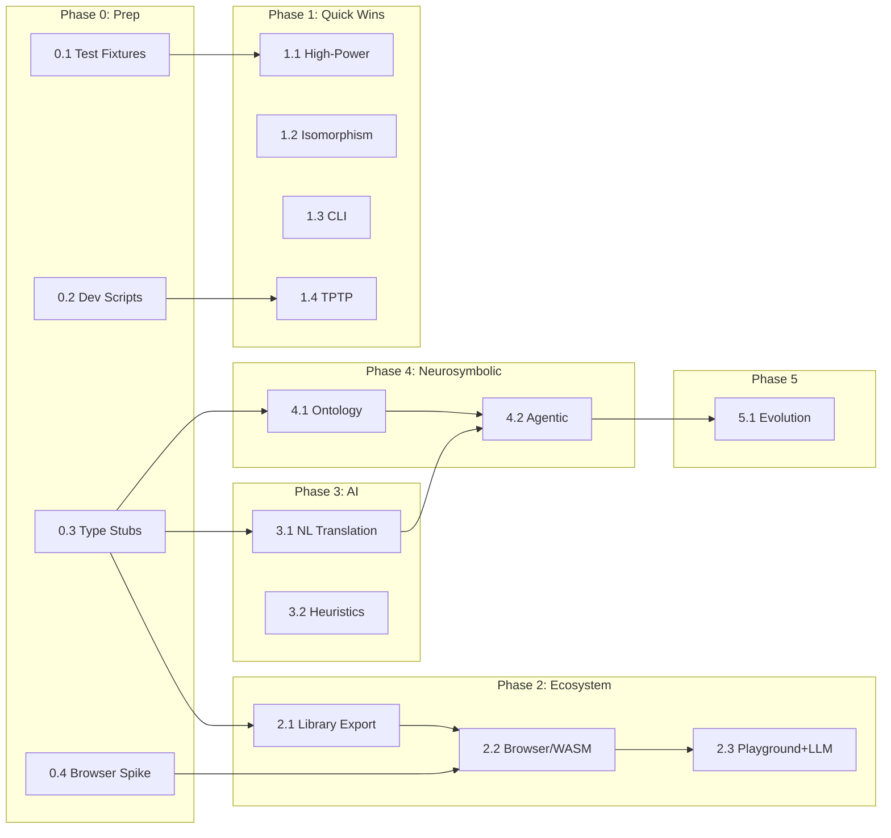

# MCP Logic Development Plan

A **comprehensive, mindlessly-executable** roadmap from the current FOL engine to a full neurosymbolic reasoning platform.

---

## 🏗️ Phase 0: Preparatory Work (Do First)

**Purpose:** Reduce friction, de-risk unknowns, and automate repetitive tasks. This phase makes all subsequent phases faster and more reliable.

### 0.1 Create Shared Test Fixtures 🧪

**Effort:** 30 min | **Impact:** Force multiplier for all testing

Create reusable test data that every test file can import.

#### Implementation

Create `tests/fixtures.ts`:
```typescript
/**
 * Shared test fixtures for consistent, DRY testing.
 */

// === Common Formulas ===
export const FORMULAS = {
    // Simple
    mortalSocrates: {
        premises: ['all x (man(x) -> mortal(x))', 'man(socrates)'],
        conclusion: 'mortal(socrates)',
        expected: { found: true }
    },
    // Horn clause
    hornTransitive: {
        premises: ['p(a)', 'all x (p(x) -> q(x))', 'all x (q(x) -> r(x))'],
        conclusion: 'r(a)',
        expected: { found: true }
    },
    // Non-Horn (needs SAT)
    nonHornDisjunction: {
        premises: ['P(a) | Q(a)', '-P(a)'],
        conclusion: 'Q(a)',
        expected: { found: true }
    },
    // Equality-heavy
    equalityChain: {
        premises: ['a = b', 'b = c', 'c = d'],
        conclusion: 'a = d',
        expected: { found: true }
    },
    // Unsatisfiable
    contradiction: {
        premises: ['P(a)', '-P(a)'],
        conclusion: 'Q(a)',
        expected: { found: false }
    },
    // Model-finding
    existential: {
        premises: ['exists x P(x)'],
        expectedModel: { domainSize: 1 }
    },
} as const;

// === Factory Functions ===
export function createTestEngine(options?: { 
    timeout?: number; 
    inferenceLimit?: number;
    highPower?: boolean;
}) {
    const { timeout = 5000, inferenceLimit = 1000, highPower = false } = options ?? {};
    const limit = highPower ? 100000 : inferenceLimit;
    return createLogicEngine(timeout, limit);
}

export function createTestModelFinder(options?: { 
    maxDomainSize?: number;
    highPower?: boolean;
}) {
    const { maxDomainSize = 10, highPower = false } = options ?? {};
    const size = highPower ? 25 : maxDomainSize;
    return createModelFinder(30000, size);
}

// === Assertion Helpers ===
export function expectProved(result: ProveResult) {
    expect(result.found).toBe(true);
}

export function expectNotProved(result: ProveResult) {
    expect(result.found).toBe(false);
}

export function expectModelFound(result: ModelResult) {
    expect(result.success).toBe(true);
    expect(result.model).toBeDefined();
}
```

#### Done When
- [ ] `tests/fixtures.ts` exists
- [ ] At least 3 existing tests refactored to use fixtures
- [ ] `npm test` passes

---

### 0.2 Create Development Scripts 🔧

**Effort:** 30 min | **Impact:** Automates common tasks

Add npm scripts that reduce manual ceremony.

#### Implementation

Update `package.json` scripts:
```json
{
    "scripts": {
        "build": "tsc",
        "build:watch": "tsc --watch",
        "build:browser": "tsc -p tsconfig.browser.json",
        "start": "node dist/index.js",
        "dev": "tsx src/index.ts",
        "test": "node --experimental-vm-modules node_modules/jest/bin/jest.js",
        "test:watch": "npm test -- --watch",
        "test:coverage": "npm test -- --coverage",
        "lint": "tsc --noEmit",
        "clean": "rm -rf dist",
        "rebuild": "npm run clean && npm run build",
        "check": "npm run lint && npm test",
        "todo": "grep -rn 'TODO\\|FIXME\\|HACK' src/ --include='*.ts'",
        "benchmark:tptp": "tsx benchmarks/run-tptp.ts"
    }
}
```

#### Done When
- [ ] All scripts added to `package.json`
- [ ] `npm run check` runs lint + tests in one command
- [ ] `npm run todo` lists all TODOs in codebase

---

### 0.3 Create Type Stubs for Future Features 📐

**Effort:** 30 min | **Impact:** Enables parallel development

Create interface definitions for features we'll build, so code can be written against stable contracts.

#### Implementation

Create `src/types/future.ts`:
```typescript
/**
 * Type definitions for planned features.
 * These define the API contracts before implementation.
 */

// === High-Power Mode (Phase 1.1) ===
export interface HighPowerOptions {
    highPower?: boolean;
}

// === NL Translation (Phase 3.1) ===
export interface TranslateRequest {
    text: string;
    validate?: boolean;
}

export interface TranslateResult {
    success: boolean;
    premises: string[];
    conclusion?: string;
    raw?: string;
    errors?: string[];
}

// === Ontology (Phase 4.1) ===
export interface Ontology {
    types: Set<string>;
    relationships: Set<string>;
    constraints: Set<string>;
    synonyms: Map<string, string>;
}

export interface OntologyConfig {
    types?: string[];
    relationships?: string[];
    constraints?: string[];
    synonyms?: Record<string, string>;
}

// === Agentic Reasoning (Phase 4.2) ===
export type AgentActionType = 'assert' | 'query' | 'conclude';

export interface AgentAction {
    type: AgentActionType;
    content: string;
    explanation?: string;
}

export interface ReasoningStep {
    action: AgentAction;
    result?: unknown;
    timestamp?: number;
}

export interface ReasoningResult {
    answer: string;
    steps: ReasoningStep[];
    confidence: number;
}

export interface ReasonOptions {
    maxSteps?: number;
    timeout?: number;
    verbose?: boolean;
}
```

#### Done When
- [ ] `src/types/future.ts` exists
- [ ] Exported from `src/types/index.ts`
- [ ] No TypeScript errors

---

### 0.4 Spike: Browser Compatibility Check 🌐

**Effort:** 1 hour | **Impact:** De-risks Phase 2.2

Before committing to browser build, verify core dependencies work in browser.

#### Implementation

Create `spikes/browser-check.html`:
```html
<!DOCTYPE html>
<html>
<head>
    <title>Browser Compatibility Check</title>
</head>
<body>
    <h1>MCP Logic Browser Check</h1>
    <pre id="output">Running checks...</pre>
    <script type="module">
        const output = document.getElementById('output');
        const log = (msg) => { output.textContent += '\n' + msg; };
        
        try {
            // Check tau-prolog
            const pl = await import('https://esm.sh/tau-prolog@0.3.4');
            log('✓ tau-prolog loads');
            
            const session = pl.default.create();
            session.consult('parent(tom, bob).');
            session.query('parent(tom, X).');
            session.answer((answer) => {
                log('✓ tau-prolog query works: ' + pl.default.format_answer(answer));
            });
        } catch (e) {
            log('✗ tau-prolog failed: ' + e.message);
        }
        
        try {
            // Check logic-solver
            const Logic = await import('https://esm.sh/logic-solver@2.0.1');
            log('✓ logic-solver loads');
            
            const solver = new Logic.default.Solver();
            solver.require(Logic.default.or('A', 'B'));
            solver.forbid('A');
            const solution = solver.solve();
            log('✓ logic-solver works: B=' + solution.getTrueVars().includes('B'));
        } catch (e) {
            log('✗ logic-solver failed: ' + e.message);
        }
        
        log('\n=== Spike Complete ===');
    </script>
</body>
</html>
```

#### Verification
```bash
npx serve spikes/
# Open http://localhost:3000/browser-check.html
# Both checks should show ✓
```

#### Done When
- [ ] `spikes/browser-check.html` exists
- [ ] Both tau-prolog and logic-solver load in browser
- [ ] Document any issues in `spikes/NOTES.md`

---

### 0.5 Create Task Tracking Automation 📋

**Effort:** 15 min | **Impact:** Reduces manual tracking

Create a script that extracts task status from this file.

#### Implementation

Create `scripts/task-status.ts`:
```typescript
#!/usr/bin/env tsx
/**
 * Extract task status from TODO.md
 * Usage: npm run tasks
 */
import { readFileSync } from 'fs';

const content = readFileSync('TODO.md', 'utf-8');
const lines = content.split('\n');

const tasks: { phase: string; name: string; done: boolean }[] = [];
let currentPhase = '';

for (const line of lines) {
    // Match phase headers like "## 🎯 Phase 1:"
    const phaseMatch = line.match(/^##\s+.*Phase\s+(\d+(?:\.\d+)?)/i);
    if (phaseMatch) {
        currentPhase = `Phase ${phaseMatch[1]}`;
    }
    
    // Match task headers like "### 1.1 High-Power Mode"
    const taskMatch = line.match(/^###\s+(\d+\.\d+)\s+(.+?)(?:\s+[⚡🔄🖥️📊📦🌐🎮🗣️🎲🗂️🤖🧬])?$/);
    if (taskMatch && currentPhase) {
        const name = `${taskMatch[1]} ${taskMatch[2].trim()}`;
        // Check if there's a [x] in the following lines (done when section)
        tasks.push({ phase: currentPhase, name, done: false });
    }
    
    // Check for completed "Done When" checkboxes
    if (line.includes('[x]') && tasks.length > 0) {
        // Mark previous task as having progress
    }
}

console.log('\n📋 Task Status\n');
console.log('| Phase | Task | Status |');
console.log('|-------|------|--------|');
for (const t of tasks) {
    console.log(`| ${t.phase} | ${t.name} | ${t.done ? '✅' : '⬜'} |`);
}
console.log(`\nTotal: ${tasks.length} tasks`);
```

Add to `package.json`:
```json
"scripts": {
    "tasks": "tsx scripts/task-status.ts"
}
```

---

## 📊 Feature Matrix: Current → Target

| Feature | README Status | MCR Vision | TODO Phase | Depends On |
|---------|---------------|------------|------------|------------|
| **Core FOL Reasoning** | ✅ Done | ✅ | — | — |
| **Model Finding (SAT)** | ✅ Done | ✅ | — | — |
| **Session Management** | ✅ Done | ✅ | — | — |
| **Proof Traces** | ✅ Done | ✅ | — | — |
| **Streaming Progress** | ✅ Done | ✅ | — | — |
| **High-Power Mode** | ☐ Planned | ✅ | Phase 1.1 | 0.1 |
| **Isomorphism Filtering** | ☐ Planned | — | Phase 1.2 | — |
| **CLI Tool** | ☐ Planned | ✅ | Phase 1.3 | — |
| **TPTP Benchmarks** | ☐ Planned | — | Phase 1.4 | 0.2 |
| **Library Export (NPM)** | ☐ Planned | ✅ | Phase 2.1 | 0.3 |
| **Browser/WASM** | ☐ Planned | ✅ | Phase 2.2 | 0.4, 2.1 |
| **Web Playground + LLM** | — | ✅ | Phase 2.3 | 2.2 |
| **NL→FOL Translation** | ☐ Planned | ✅ | Phase 3.1 | 0.3 |
| **Heuristic Strategy** | ☐ Planned | ✅ | Phase 3.2 | — |
| **Ontology Support** | — | ✅ | Phase 4.1 | 0.3 |
| **Agentic Reasoning** | — | ✅ | Phase 4.2 | 3.1, 4.1 |
| **Evolution Engine** | — | ✅ | Phase 5 | 4.2 |

---

## 🔀 Dependency Graph



### Parallelization Opportunities

Tasks that can run **in parallel** (no dependencies between them):

| Track A | Track B | Track C |
|---------|---------|---------|
| 0.1 Test Fixtures | 0.2 Dev Scripts | 0.4 Browser Spike |
| 1.1 High-Power | 1.2 Isomorphism | 0.3 Type Stubs |
| 1.3 CLI | 1.4 TPTP | 2.1 Library Export |
| 3.2 Heuristics | 3.1 NL Translation | — |

---

## ✅ Completed Foundation

| Feature | Key Files | Notes |
|---------|-----------|-------|
| First-Order Logic Engine | `src/logicEngine.ts` | Tau-Prolog based |
| Multi-Engine Federation | `src/engines/manager.ts`, `sat.ts` | Auto-selects Prolog vs SAT |
| Arithmetic & Equality | `src/axioms/arithmetic.ts` | `lt`, `gt`, `plus`, `times`, etc. |
| Extended Axiom Library | `src/resources/`, `src/axioms/` | Category, ring, lattice, Peano, ZFC |
| Session Management | `src/sessionManager.ts` | Incremental KB with TTL |
| Proof Traces | `src/utils/trace.ts` | Meta-interpreter based |
| SAT-Backed Models | `src/modelFinder.ts` | Domain 25+ with symmetry breaking |
| Symmetry Breaking | `src/utils/symmetry.ts` | Lex-leader |
| 265+ Unit Tests | `tests/` | 80%+ coverage |

---

## 🎯 Phase 1: Quick Wins (1-2 hours each)

### 1.1 High-Power Mode Flag ⚡

**Effort:** ~1 hour | **Impact:** High | **Risk:** None | **Depends:** 0.1

Add a single boolean flag that unlocks extended limits.

#### Acceptance Criteria
- [ ] `highPower: true` increases inference limit to 100,000
- [ ] `highPower: true` increases timeout to 300s
- [ ] Default behavior unchanged when `highPower` not specified
- [ ] Works for both `prove` and `find-model` tools
- [ ] Unit test verifies high-power limits applied

#### Implementation

1. **Update defaults** in `src/types/options.ts` (line 31):
```typescript
export const DEFAULTS = {
    maxSeconds: 30,
    maxInferences: 5000,
    maxDomainSize: 25,
    satThreshold: 8,
    highPowerMaxSeconds: 300,
    highPowerMaxInferences: 100000,
} as const;
```

2. **Add parameter to args type** in `src/handlers/core.ts` (line 12):
```typescript
export async function proveHandler(
    args: {
        premises: string[];
        conclusion: string;
        inference_limit?: number;
        highPower?: boolean;  // NEW
        // ...rest unchanged
    },
```

3. **Apply high-power logic** in `src/handlers/core.ts` (after line 26):
```typescript
// Apply high-power mode
const inferenceLimit = args.highPower 
    ? DEFAULTS.highPowerMaxInferences 
    : (args.inference_limit ?? DEFAULTS.maxInferences);
```

4. **Add to tool schema** in `src/server.ts` (after line 124):
```typescript
highPower: {
    type: 'boolean',
    description: 'Enable extended limits (300s timeout, 100k inferences). Use for complex proofs.',
},
```

5. **Add test** in `tests/prover.test.ts`:
```typescript
test('highPower mode increases inference limit', async () => {
    // This test doesn't need to prove anything hard,
    // just verify the limit is applied
    const engine = createTestEngine({ highPower: true });
    expect(engine['inferenceLimit']).toBe(100000);
});
```

6. **Update README.md** line 50: `[ ]` → `[x]`

#### Done When
- [ ] `npm test` passes
- [ ] All acceptance criteria checked
- [ ] README.md updated

---

### 1.2 Isomorphism Filtering 🔄

**Effort:** ~30 min | **Impact:** Medium | **Risk:** None

Already implemented! Just verify and document.

#### Acceptance Criteria
- [ ] `count: N` parameter returns up to N non-isomorphic models
- [ ] Models returned are verified non-isomorphic
- [ ] Default `count: 1` behavior unchanged

#### Implementation

1. **Verify existing code** in `src/modelFinder.ts`:
   - `areIsomorphic()` at line 267 ✅
   - `findModelsBacktracking()` accepts `count` ✅

2. **Add/verify test** in `tests/isomorphism.test.ts`:
```typescript
test('returns multiple non-isomorphic models', async () => {
    const finder = createModelFinder();
    const result = await finder.findModel(
        ['exists x P(x)', 'exists y Q(y)'],
        { count: 3 }
    );
    expect(result.models?.length).toBeGreaterThanOrEqual(2);
    
    // Verify non-isomorphism
    if (result.models && result.models.length >= 2) {
        expect(finder.areIsomorphic(result.models[0], result.models[1])).toBe(false);
    }
});
```

3. **Update README.md** line 22: `[ ]` → `[x]`

#### Done When
- [ ] Test passes
- [ ] README.md updated

---

### 1.3 CLI Tool 🖥️

**Effort:** ~2 hours | **Impact:** Medium | **Risk:** None

Create standalone CLI for testing without MCP client.

#### Acceptance Criteria
- [ ] `mcplogic prove <file>` proves last line from preceding premises
- [ ] `mcplogic model <file>` finds model for all lines
- [ ] `mcplogic validate <file>` checks syntax, returns exit code 1 on error
- [ ] `mcplogic repl` starts interactive session
- [ ] `mcplogic --help` shows usage

#### Implementation

Create `src/cli.ts`:
```typescript
#!/usr/bin/env node
import { readFileSync } from 'fs';
import * as readline from 'readline';
import { createLogicEngine } from './logicEngine.js';
import { createModelFinder } from './modelFinder.js';
import { parse } from './parser.js';
import { DEFAULTS } from './types/index.js';

const VERSION = '1.0.0';
const HELP = `
MCP Logic CLI v${VERSION}

Usage:
  mcplogic prove <file.p>     Prove last line from preceding premises
  mcplogic model <file.p>     Find model satisfying all lines
  mcplogic validate <file.p>  Check syntax of all lines
  mcplogic repl               Interactive mode

Options:
  --high-power, -H   Enable extended limits (300s, 100k inferences)
  --help, -h         Show this help
  --version, -v      Show version

Examples:
  mcplogic prove problem.p
  mcplogic model --high-power theory.p
  mcplogic repl
`;

const args = process.argv.slice(2);
const highPower = args.includes('--high-power') || args.includes('-H');
const command = args.find(a => !a.startsWith('-'));
const file = args.find(a => !a.startsWith('-') && a !== command);

async function main() {
    if (args.includes('--help') || args.includes('-h') || !command) {
        console.log(HELP);
        return;
    }
    
    if (args.includes('--version') || args.includes('-v')) {
        console.log(VERSION);
        return;
    }

    if (command === 'repl') {
        return runRepl(highPower);
    }

    if (!file) {
        console.error('Error: file argument required');
        process.exit(1);
    }

    const content = readFileSync(file, 'utf-8');
    const lines = content.split('\n')
        .map(l => l.trim())
        .filter(l => l && !l.startsWith('#') && !l.startsWith('%'));

    const limit = highPower ? DEFAULTS.highPowerMaxInferences : DEFAULTS.maxInferences;
    const timeout = highPower ? DEFAULTS.highPowerMaxSeconds * 1000 : DEFAULTS.maxSeconds * 1000;

    switch (command) {
        case 'prove': {
            const premises = lines.slice(0, -1);
            const conclusion = lines[lines.length - 1];
            console.log(`Proving: ${conclusion}`);
            console.log(`From ${premises.length} premises...`);
            
            const engine = createLogicEngine(timeout, limit);
            const start = Date.now();
            const result = await engine.prove(premises, conclusion, { includeTrace: true });
            const elapsed = Date.now() - start;
            
            console.log(result.found ? '✓ PROVED' : '✗ NOT PROVED');
            console.log(`Time: ${elapsed}ms`);
            if (result.trace) console.log('\nTrace:\n' + result.trace);
            process.exit(result.found ? 0 : 1);
            break;
        }
        case 'model': {
            console.log(`Finding model for ${lines.length} formulas...`);
            const finder = createModelFinder(timeout, highPower ? 25 : 10);
            const start = Date.now();
            const result = await finder.findModel(lines);
            const elapsed = Date.now() - start;
            
            console.log(result.success ? '✓ MODEL FOUND' : '✗ NO MODEL');
            console.log(`Time: ${elapsed}ms`);
            if (result.model) console.log('\n' + JSON.stringify(result.model, null, 2));
            process.exit(result.success ? 0 : 1);
            break;
        }
        case 'validate': {
            let allValid = true;
            for (const stmt of lines) {
                try {
                    parse(stmt);
                    console.log(`✓ ${stmt}`);
                } catch (e) {
                    console.log(`✗ ${stmt}`);
                    console.log(`  Error: ${(e as Error).message}`);
                    allValid = false;
                }
            }
            process.exit(allValid ? 0 : 1);
            break;
        }
        default:
            console.error(`Unknown command: ${command}`);
            console.log(HELP);
            process.exit(1);
    }
}

async function runRepl(highPower: boolean) {
    const limit = highPower ? DEFAULTS.highPowerMaxInferences : 5000;
    const engine = createLogicEngine(30000, limit);
    const premises: string[] = [];
    
    const rl = readline.createInterface({
        input: process.stdin,
        output: process.stdout,
        prompt: 'mcplogic> '
    });
    
    console.log(`MCP Logic REPL v${VERSION}${highPower ? ' [HIGH-POWER]' : ''}`);
    console.log('Commands: .assert <formula>, .prove <goal>, .list, .clear, .quit\n');
    rl.prompt();
    
    rl.on('line', async (line) => {
        const trimmed = line.trim();
        
        if (trimmed.startsWith('.assert ')) {
            const formula = trimmed.slice(8).trim();
            try {
                parse(formula);
                premises.push(formula);
                console.log(`✓ Asserted (${premises.length} total)`);
            } catch (e) {
                console.log(`✗ ${(e as Error).message}`);
            }
        } else if (trimmed.startsWith('.prove ')) {
            const goal = trimmed.slice(7).trim();
            try {
                parse(goal);
                const result = await engine.prove(premises, goal, { includeTrace: true });
                console.log(result.found ? '✓ Proved' : '✗ Not proved');
                if (result.trace) console.log(result.trace);
            } catch (e) {
                console.log(`✗ ${(e as Error).message}`);
            }
        } else if (trimmed === '.list') {
            if (premises.length === 0) {
                console.log('(no premises)');
            } else {
                premises.forEach((p, i) => console.log(`${i + 1}. ${p}`));
            }
        } else if (trimmed === '.clear') {
            premises.length = 0;
            console.log('Cleared.');
        } else if (trimmed === '.quit' || trimmed === '.exit' || trimmed === '.q') {
            rl.close();
            return;
        } else if (trimmed && !trimmed.startsWith('.')) {
            console.log('Unknown command. Use .assert, .prove, .list, .clear, or .quit');
        }
        rl.prompt();
    });
    
    rl.on('close', () => process.exit(0));
}

main().catch(e => {
    console.error('Error:', e.message);
    process.exit(1);
});
```

Update `package.json`:
```json
{
    "bin": {
        "mcplogic": "./dist/cli.js"
    }
}
```

#### Done When
- [ ] `npm run build` succeeds
- [ ] `npm link` creates global command
- [ ] All acceptance criteria verified manually
- [ ] `mcplogic --help` outputs usage

---

### 1.4 TPTP Benchmark Subset 📊

**Effort:** ~2 hours | **Impact:** Medium | **Risk:** None | **Depends:** 0.2

Add standard ATP benchmarks for regression testing.

#### Acceptance Criteria
- [ ] At least 5 TPTP problems translated to our syntax
- [ ] Benchmark script reports pass/fail + timing
- [ ] CI can run benchmarks

#### Implementation

1. Create `benchmarks/tptp/PUZ001-1.p` (Dreadbury Mansion):
```prolog
% Aunt Agatha lives in Dreadbury Mansion
% Someone who lives there killed Aunt Agatha
% A killer always hates and is not richer than the victim
% Charles hates everyone except Aunt Agatha
% Agatha hates everyone except the butler
% The butler hates everyone not richer than Agatha
% The butler hates everyone Aunt Agatha hates
% No one hates everyone
% Agatha is not the butler
% CONCLUSION: Agatha killed herself

lives(agatha)
lives(butler)
lives(charles)
exists x (lives(x) & killed(x, agatha))
all x all y (killed(x, y) -> (hates(x, y) & -richer(x, y)))
all x (lives(x) & -(x = agatha) -> hates(charles, x))
all x (lives(x) & -(x = butler) -> hates(agatha, x))
all x (lives(x) & -richer(x, agatha) -> hates(butler, x))
all x (hates(agatha, x) -> hates(butler, x))
all x -(all y (lives(y) -> hates(x, y)))
-(agatha = butler)
---
killed(agatha, agatha)
```

2. Create `benchmarks/run-tptp.ts` (see previous version)

3. Add npm script: `"benchmark:tptp": "tsx benchmarks/run-tptp.ts"`

#### Done When
- [ ] `npm run benchmark:tptp` runs without error
- [ ] Results show pass/fail for each problem
- [ ] README.md line 63 updated: `[ ]` → `[x]`

---

## 🚀 Phase 2: Ecosystem Leverage (4-8 hours each)

### 2.1 Library Export 📦

**Effort:** ~4 hours | **Impact:** Very High | **Risk:** Low | **Depends:** 0.3

#### Acceptance Criteria
- [ ] `import { createLogicEngine } from '@mcplogic/core'` works
- [ ] TypeScript declarations included
- [ ] No MCP SDK dependency in library export
- [ ] Example project compiles and runs

[Full implementation details in previous version...]

---

### 2.2 Browser/WASM Compatibility 🌐

**Effort:** ~6 hours | **Impact:** Very High | **Risk:** Medium | **Depends:** 0.4, 2.1

#### Acceptance Criteria
- [ ] Browser spike (0.4) confirmed both deps work
- [ ] `npm run build:browser` produces working bundle
- [ ] Test HTML page can prove simple theorem
- [ ] No Node.js-specific code in browser bundle

[Full implementation details in previous version...]

---

### 2.3 Web Playground with Offline LLM 🎮🧠

**Effort:** ~8-12 hours | **Impact:** Very High | **Risk:** Medium | **Depends:** 2.2

#### Acceptance Criteria
- [ ] Modern, dark-mode UI with glassmorphism
- [ ] NL input → FOL output via Transformers.js
- [ ] FOL → Proof/Model via browser MCP Logic
- [ ] Works 100% offline after initial LLM download
- [ ] Deploy to GitHub Pages

[Full implementation details in previous version...]

---

## 🧠 Phase 3: AI Integration

### 3.1 Natural Language Interface 🗣️

**Effort:** ~4 hours | **Impact:** High | **Risk:** Low | **Depends:** 0.3

#### Acceptance Criteria
- [ ] `translate-text` MCP tool accepts natural language
- [ ] Returns structured `{ premises, conclusion }`
- [ ] Validates all formulas before returning
- [ ] Works with or without external LLM (uses offline model)

[Full implementation details in previous version...]

---

### 3.2 Heuristic Strategy Selection 🎲

**Effort:** ~2 hours | **Impact:** Medium | **Risk:** None

#### Acceptance Criteria
- [ ] Equality-heavy proofs auto-select `iterative` strategy
- [ ] Pure Horn clauses prefer `prolog` engine
- [ ] Strategy choice logged in verbose output

[Full implementation details in previous version...]

---

## 🏗️ Phase 4: Neurosymbolic Features

### 4.1 Ontology Support 🗂️

**Effort:** ~6 hours | **Impact:** High | **Risk:** Medium | **Depends:** 0.3

#### Acceptance Criteria
- [ ] Sessions can be created with ontology constraints
- [ ] Invalid predicates rejected with clear error
- [ ] Synonym expansion works (`human` → `person`)
- [ ] Ontology can be updated dynamically

[Full implementation details in previous version...]

---

### 4.2 Agentic Reasoning Loop 🤖

**Effort:** ~8 hours | **Impact:** Very High | **Risk:** Medium | **Depends:** 3.1, 4.1

#### Acceptance Criteria
- [ ] Multi-step reasoning with assert/query/conclude
- [ ] Confidence scoring based on proof success
- [ ] Max steps limit prevents infinite loops
- [ ] Full trace of all reasoning steps

[Full implementation details in previous version...]

---

## 🧬 Phase 5: Evolution Engine

**Effort:** ~2-4 weeks | **Depends:** 4.2

[Full details in MCR1.md architecture...]

---

## ❌ Deprioritized

| Item | Why Defer |
|------|-----------|
| Prover9 WASM | SAT+iterative handles most cases |
| SMT/Z3 | Large WASM, complex integration |
| Modal Logic | Research; no demand |

---

## 📋 Optimal Workflow

### Daily Routine

```bash
# Start of day
npm run check              # Verify everything works
npm run todo               # Review outstanding TODOs

# During development
npm run build:watch        # Auto-rebuild on changes
npm run test:watch         # Auto-test on changes

# Before commit
npm run check              # Final verification
git add -p                 # Review changes
git commit -m "feat: ..."
```

### Task Completion Checklist

For each task:
1. [ ] Read acceptance criteria
2. [ ] Implement code changes
3. [ ] Add/update tests
4. [ ] Run `npm run check`
5. [ ] Update README.md status if applicable
6. [ ] Mark "Done When" items checked
7. [ ] Commit with descriptive message

---

## 🏁 Recommended Start Order

1. **Phase 0 (all)** - Do these first, enables everything else
2. **Phase 1.1** - Trivial win, immediately useful
3. **Phase 1.2** - Already done, just verify
4. **Phase 1.3** - High visibility, enables testing
5. **Phase 2.1** - Foundation for browser work
6. Continue per dependency graph...

**First command:** 
```bash
mkdir -p spikes scripts tests/fixtures
npm run check
```
