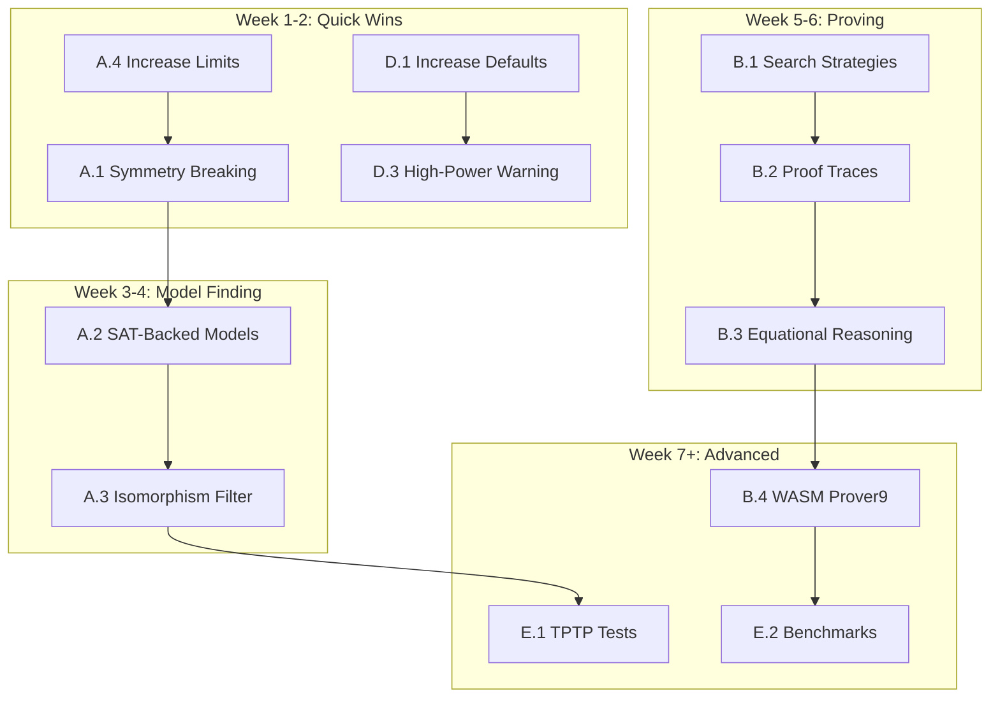

# MCP Logic — Improvement Plan to Match/Exceed Prover9-Mace4

> **Goal:** Elevate TypeScript MCP Logic (**#1**) to on-par or superior reasoning capability vs Python-based MCP-Logic with Prover9/Mace4 (**#2**), while preserving its key self-contained advantages.

> **Key Constraints:** Pure npm self-containment, no external binaries, easy deployment, maintain existing session management, verbosity controls, and engine federation.

---

## Executive Summary

This plan addresses four priority areas from the specification, organized into actionable phases:

| Priority | Area | Current State | Target State |
|----------|------|---------------|--------------|
| 🔴 **P0** | Model Finding | Domain ≤10, brute-force | Domain 20-50, symmetry-breaking, SAT-backed |
| 🔴 **P1** | Proving Power | Tau-Prolog (Horn), basic SAT | Configurable strategies, proof traces, WASM ATP |
| 🟡 **P2** | Feature Parity | Arithmetic axioms, equality | Unified arithmetic, rich proof output, advanced config |
| 🟢 **P3** | Scalability | 1000 inference limit | Higher limits, optimization, high-power mode |

---

## Phase A: Model Finding Upgrades (Core Priority)

*Target: Domain sizes 20-50, competitive with Mace4*

### A.1 Symmetry Breaking (Lex-Leader)

**Goal:** Reduce search space by up to `n!` for `n` constants.

**Files:** `src/modelFinder.ts`

**Tasks:**
- [ ] Implement canonical ordering constraint (lexicographic leader)
- [ ] Force `c_i ≤ c_{i+1}` to eliminate symmetric assignments
- [ ] Add `enableSymmetryBreaking?: boolean` option (default: true)

**Algorithm:**
```typescript
// Only yield assignments where constants are ordered
function* enumerateWithSymmetryBreaking(
    constants: string[],
    domainSize: number
): Generator<Map<string, number>> {
    // Lex-leader: first constant assigned to 0,
    // second to 0 or 1, third to 0, 1, or 2, etc.
    // New elements introduced only when needed
}
```

**Effort:** 1-2 days  
**Impact:** 10-100x reduction in search space for many-constant problems

---

### A.2 SAT-Backed Model Finding

**Goal:** Use SAT solver for model finding beyond small domains.

**Files:** `src/modelFinder.ts`, `src/engines/sat.ts`

**Tasks:**
- [ ] Add `ModelFinder.findModelViaSAT()` method
- [ ] Implement grounding: instantiate FOL predicates over finite domain
- [ ] Convert grounded formula to propositional CNF
- [ ] Use existing `SATEngine.checkSat()` for satisfiability
- [ ] Extract model from SAT assignment
- [ ] Add fallback logic: brute-force ≤8, SAT 9-50

**Grounding Strategy:**
```typescript
// For domain {0, 1, 2} and predicate P(x):
// Create propositional variables: P_0, P_1, P_2
// For all x P(x) → P_0 ∧ P_1 ∧ P_2
// For exists x P(x) → P_0 ∨ P_1 ∨ P_2
```

**Effort:** 3-4 days  
**Impact:** Enables domain sizes 20-50 efficiently

---

### A.3 Isomorphism Filtering

**Goal:** Detect and skip isomorphic models.

**Files:** `src/modelFinder.ts`, `src/utils/isomorphism.ts` (new)

**Tasks:**
- [ ] Implement model canonicalization (sort by predicate tuples)
- [ ] Maintain hash set of canonical forms
- [ ] Skip models with seen canonical forms
- [ ] Add `unique_models?: boolean` option

**Effort:** 2 days  
**Impact:** Dramatic reduction in redundant models reported

---

### A.4 Increase Domain Size Limits

**Goal:** Raise configurable max domain from 10 to 50+.

**Files:** `src/modelFinder.ts`, `src/server.ts`

**Tasks:**
- [ ] Change default `maxDomainSize` from 10 to 20
- [ ] Allow user-configurable max up to 100 (with SAT backend)
- [ ] Add timeout-per-domain-size heuristic
- [ ] Add progress reporting for long searches

**Effort:** 0.5 day  
**Impact:** Immediate capability improvement

---

## Phase B: Proving Power Enhancements

*Target: Competitive with Prover9 on standard benchmarks*

### B.1 Configurable Search Strategies

**Goal:** Expose Prover9-like parameters for proof search.

**Files:** `src/logicEngine.ts`, `src/engines/interface.ts`, `src/server.ts`

**Tasks:**
- [ ] Add `max_seconds?: number` parameter (timeout in seconds, not inference limit)
- [ ] Add `max_proofs?: number` parameter (stop after N proofs found)
- [ ] Add `weight_limit?: number` for clause weight thresholds
- [ ] Add `search_strategy?: 'breadth' | 'depth' | 'iterative'` option
- [ ] Implement iterative deepening for Prolog engine

**Interface:**
```typescript
interface AdvancedProveOptions extends ProveOptions {
    maxSeconds?: number;        // Default: 30
    maxProofs?: number;         // Default: 1
    weightLimit?: number;       // Default: 100
    searchStrategy?: 'breadth' | 'depth' | 'iterative';
}
```

**Effort:** 2-3 days  
**Impact:** Enables tackling harder theorems

---

### B.2 Proof Trace Output

**Goal:** Human-readable step-by-step derivations like Prover9.

**Files:** `src/logicEngine.ts`, `src/types/index.ts`, `src/utils/response.ts`

**Tasks:**
- [ ] Capture inference steps during Prolog execution
- [ ] Format as structured proof trace with step numbers
- [ ] Include rule applied (resolution, paramodulation, etc.)
- [ ] Add `proof_trace?: ProofStep[]` to detailed response
- [ ] For SAT engine: return refutation proof (clause dependency DAG)

**Output Format:**
```typescript
interface ProofStep {
    stepNumber: number;
    clause: string;
    justification: 'given' | 'resolved' | 'factored' | 'paramodulated';
    parents: number[];  // Step numbers of parent clauses
}
```

**Effort:** 3-4 days  
**Impact:** Critical for debugging and understanding proofs

---

### B.3 Enhanced Equational Reasoning

**Goal:** Better handling of equality-heavy theories.

**Files:** `src/equalityAxioms.ts`, `src/logicEngine.ts`

**Tasks:**
- [ ] Implement demodulation (oriented rewriting)
- [ ] Add Knuth-Bendix ordering for term comparison
- [ ] Support AC (associative-commutative) unification hints
- [ ] Add `enable_demodulation?: boolean` option
- [ ] Increase equality iteration limits

**Effort:** 4-5 days  
**Impact:** Handles group theory, ring axioms better

---

### B.4 Optional WASM Prover9 Integration

**Goal:** Provide Prover9-level power when needed, maintain self-containment.

**Files:** `src/engines/prover9.ts` (new), `wasm/` directory (new)

**Tasks:**
- [ ] Research: Compile Prover9/LADR to WASM via Emscripten
- [ ] Bundle WASM blob (~2-5MB) if feasible
- [ ] Implement `Prover9Engine` adapter
- [ ] Add lazy loading (only load WASM when used)
- [ ] Fallback to Tau-Prolog/SAT if WASM unavailable

**Feasibility Assessment:**
- Prover9 is ~50K lines of C
- Emscripten can compile, but output may be 5-10MB
- Alternative: lighter ATP like leanCoP or nanoCoP

**Effort:** 2-4 weeks (research-heavy)  
**Impact:** Full Prover9 parity, but maintaining npm self-containment

> [!WARNING]
> WASM integration is high-effort and may require significant research. Consider as Phase 2+ priority.

---

### B.5 Unified Arithmetic Handling

**Goal:** Arithmetic works across both Prolog and SAT engines.

**Files:** `src/arithmetic.ts`, `src/engines/sat.ts`

**Tasks:**
- [ ] Extend SAT engine to recognize arithmetic predicates
- [ ] Implement bounded integer arithmetic for SAT (encode as propositional)
- [ ] Example: `X < Y` for domain {0,1,2} → propositional constraints
- [ ] Ensure `enable_arithmetic` works for both engines
- [ ] Add tests for arithmetic across engines

**Effort:** 2-3 days  
**Impact:** Consistent arithmetic regardless of engine choice

---

## Phase C: Feature Parity and Enhancements

### C.1 Detailed Proof and Model Output

**Goal:** Rich, structured output matching Prover9/Mace4.

**Files:** `src/modelFinder.ts`, `src/types/index.ts`

**Tasks:**
- [ ] Return function interpretations in models (not just predicates)
- [ ] Include constant assignments with domain element labels
- [ ] Add model statistics (domain size, interpretation counts)
- [ ] Return multiple models when available (`max_models?: number`)

**Enhanced Model Output:**
```typescript
interface EnhancedModel extends Model {
    functions: Record<string, Map<string, number>>;  // f(a) = 2
    constants: Record<string, number>;                // a = 0, b = 1
    statistics: {
        domainSize: number;
        predicateCount: number;
        totalTuples: number;
    };
}
```

**Effort:** 1-2 days  
**Impact:** Much clearer model interpretation

---

### C.2 Advanced Configuration Options

**Goal:** Expose Prover9-like flags via MCP tool parameters.

**Files:** `src/server.ts`

**Tasks:**
- [ ] Add `hints?: string[]` parameter for guiding proof search
- [ ] Add `max_weight?: number` for clause weighting
- [ ] Add `sos_strategy?: 'all' | 'input_only'` for set-of-support
- [ ] Document all new parameters in tool schemas

**Effort:** 1 day  
**Impact:** Power users can tune prover behavior

---

### C.3 Categorical and Algebraic Reasoning

**Goal:** Strengthen built-in axiom support.

**Files:** `src/axioms/`, `src/resources/axioms.ts`

**Tasks:**
- [ ] Add more algebraic axiom sets: Ring, Field, Lattice, Boolean Algebra
- [ ] Add automated diagram chasing for category theory
- [ ] Implement universal property verification helpers
- [ ] Expand `logic://axioms/*` resources

**Effort:** 2-3 days  
**Impact:** Better support for mathematical reasoning

---

## Phase D: Performance and Scalability

### D.1 Increase Default Limits

**Goal:** Handle medium-complexity theorems out-of-the-box.

**Files:** `src/logicEngine.ts`, `src/modelFinder.ts`

**Tasks:**
- [ ] Increase default `inferenceLimit` from 1000 to 5000
- [ ] Increase default `maxDomainSize` from 10 to 20
- [ ] Increase default timeout from 5s to 30s
- [ ] Add `high_power_mode?: boolean` for aggressive limits

**High-Power Mode:**
```typescript
const HIGH_POWER_DEFAULTS = {
    inferenceLimit: 50000,
    maxDomainSize: 50,
    timeout: 120000,  // 2 minutes
};
```

**Effort:** 0.5 day  
**Impact:** Immediate handling of harder problems

---

### D.2 Performance Optimization

**Goal:** Faster handling of medium-complexity theorems.

**Files:** `src/translator.ts`, `src/clausifier.ts`, `src/modelFinder.ts`

**Tasks:**
- [ ] Profile clausification hotspots
- [ ] Optimize CNF distribution (lazy evaluation, memoization)
- [ ] Cache parsed ASTs for repeated premises
- [ ] Optimize unification in Prolog translation
- [ ] Add benchmarking suite for regression tracking

**Performance Targets:**
| Operation | Current | Target |
|-----------|---------|--------|
| Clausify (10 clauses) | ~20ms | ~5ms |
| Model find (domain 8) | ~500ms | ~100ms |
| Prove (simple theorem) | ~50ms | ~20ms |

**Effort:** 2-3 days  
**Impact:** Faster overall experience

---

### D.3 High-Power Mode Warning

**Goal:** Warn users about long-running operations.

**Files:** `src/server.ts`

**Tasks:**
- [ ] Detect when high-power mode is activated
- [ ] Include warning in response: "This operation may take up to 2 minutes"
- [ ] Add estimated time remaining for progress feedback

**Effort:** 0.5 day  
**Impact:** Better UX for complex problems

---

## Phase E: Testing and Benchmarks

*Target: >300 tests, TPTP benchmark subset*

### E.1 Expand Test Suite

**Current:** 254 tests passing

**Tasks:**
- [ ] Add TPTP library subset (SYN, SET, GRP categories)
- [ ] Add Pelletier problems (75 classical FOL problems)
- [ ] Add direct comparison tests vs Prover9/Mace4 expected outputs
- [ ] Add edge case tests: empty premises, deep nesting (>10 levels)
- [ ] Add performance regression tests

**Target:** 350+ tests

**Effort:** 3-4 days  
**Impact:** Confidence in correctness

---

### E.2 Benchmark Suite

**Goal:** Track and compare performance systematically.

**Files:** `tests/benchmarks/` (new), `scripts/benchmark.ts` (new)

**Tasks:**
- [ ] Create benchmark runner script
- [ ] Include timing comparisons for:
  - Group theory problems (associativity, identity)
  - Pelletier problems subset (P1-P25)
  - Model finding at various domain sizes
- [ ] Generate performance report (markdown table)
- [ ] Set up CI regression gate on performance

**Effort:** 2 days  
**Impact:** Measurable progress tracking

---

## Implementation Sequence (Recommended)



---

## Priority Order

| Priority | Item | Effort | Impact | Dependencies |
|----------|------|--------|--------|--------------|
| 🔴 P0-1 | A.4 Increase Domain Limits | 0.5d | High | None |
| 🔴 P0-2 | D.1 Increase Default Limits | 0.5d | High | None |
| 🔴 P0-3 | A.1 Symmetry Breaking | 2d | Very High | A.4 |
| 🔴 P0-4 | A.2 SAT-Backed Model Finding | 4d | Very High | A.1 |
| 🟡 P1-1 | B.2 Proof Trace Output | 3d | High | None |
| 🟡 P1-2 | B.1 Configurable Strategies | 2d | Medium | None |
| 🟡 P1-3 | A.3 Isomorphism Filtering | 2d | Medium | A.2 |
| 🟢 P2-1 | C.1 Enhanced Model Output | 2d | Medium | A.2 |
| 🟢 P2-2 | E.1 TPTP Test Suite | 3d | High | All above |
| 🔵 P3-1 | B.4 WASM Prover9 | 2-4w | Very High | Research |
| 🔵 P3-2 | B.3 Enhanced Equational | 4d | Medium | B.1 |

---

## Acceptance Criteria

### On-Par with Prover9/Mace4:
- [ ] Successfully proves all Pelletier problems P1-P25
- [ ] Finds models in domain ≤20 for group theory axiom sets
- [ ] Comparable speed on standard benchmarks (within 2x)

### Better than Prover9/Mace4:
- [ ] Fully self-contained (no external binaries)
- [ ] Session-based incremental reasoning
- [ ] Token-efficient outputs for LLM chaining
- [ ] Verbosity controls (minimal/standard/detailed)
- [ ] MCP-native with resources and prompts

### Testing:
- [ ] 350+ tests passing
- [ ] TPTP subset included
- [ ] Benchmark suite with regression tracking

---

## Files to Create/Modify

### New Files:
- `src/utils/isomorphism.ts` — Model isomorphism detection
- `src/engines/prover9.ts` — WASM Prover9 adapter (future)
- `wasm/prover9.wasm` — Compiled Prover9 (future)
- `tests/benchmarks/` — Benchmark suite
- `scripts/benchmark.ts` — Benchmark runner

### Modified Files:
- `src/modelFinder.ts` — Symmetry breaking, SAT integration, larger domains
- `src/logicEngine.ts` — Higher limits, search strategies, proof traces
- `src/engines/sat.ts` — Grounding, arithmetic support
- `src/server.ts` — New parameters, high-power mode
- `src/types/index.ts` — Enhanced response types
- `tests/*.test.ts` — New test cases

---

## Risk Assessment

| Risk | Likelihood | Impact | Mitigation |
|------|------------|--------|------------|
| WASM Prover9 too large | High | Medium | Use lighter ATP (leanCoP) or defer |
| SAT grounding blowup | Medium | High | Limit domain for SAT path, use heuristics |
| Performance regression | Low | Medium | Benchmark suite, CI gates |
| Breaking API changes | Low | High | Maintain backwards compatibility |

---

## Notes

- **Prioritize A.1 and A.2** as model finding upgrades are "critical for practical use" per specification
- **B.4 (WASM Prover9)** is high-effort; can proceed with other phases first
- All changes should maintain backwards compatibility with existing API
- Testing against #2 (Python/Prover9) outputs will validate parity
